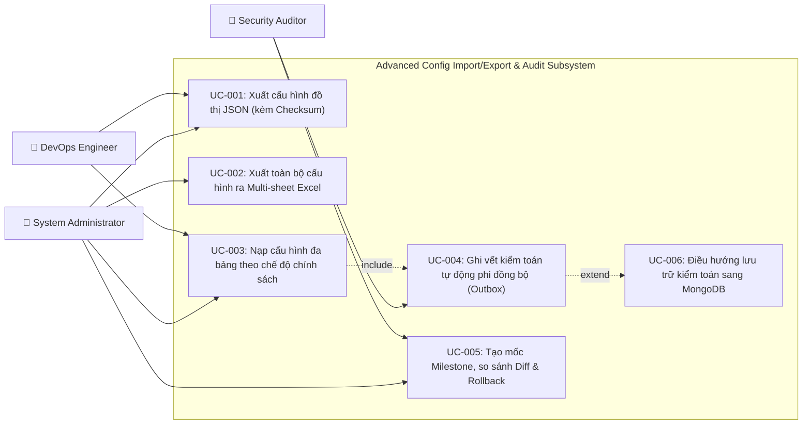

# Tài liệu Phân tích Nghiệp vụ: Advanced Config Import/Export & Audit Framework

> Đặc tả ngữ nghĩa nghiệp vụ chi tiết — phân rã theo Use Case, luồng xử lý dữ liệu và ma trận truy xuất.

---

## 1. Tổng quan (Overview)

### 1.1 Bối cảnh nghiệp vụ (Business Context)
Trong một nền tảng ngân hàng số hoặc hệ sinh thái doanh nghiệp lớn, cấu hình hệ thống (System Configuration) là tài sản trọng yếu quyết định hành vi vận hành của toàn bộ ứng dụng:
- **Tính nhất quán giữa các môi trường**: Đội ngũ DevOps và Quản trị viên cần đồng bộ cấu hình (Menu, Phân quyền, Danh mục tổ chức, Tham số nghiệp vụ, Thông điệp đa ngữ) giữa các môi trường Phát triển (DEV), Kiểm thử (STAGING/UAT) và Vận hành thực tế (PRODUCTION) một cách nhanh chóng, chính xác, không gây lỗi vi phạm toàn vẹn khóa ngoại.
- **Khả năng phục hồi sự cố (Disaster Recovery & Rollback)**: Khi một đợt cập nhật cấu hình gây lỗi ứng dụng, hệ thống phải cho phép so sánh khác biệt (Diff) trực quan và hoàn tác (Rollback) theo từng mốc cấu hình (Milestone) đã được đóng dấu thời gian.
- **Kiểm toán tuân thủ (Audit & Regulatory Compliance)**: Các tiêu chuẩn an toàn bảo mật (PCI-DSS, ISO 27001, Ngân hàng Nhà nước) yêu cầu mọi thao tác thay đổi cấu hình phải được ghi nhận lịch sử bất biến (Ai sửa, Sửa gì, Lúc nào, Trạng thái trước và sau), đồng thời việc ghi vết kiểm toán không được phép làm suy giảm hiệu năng giao dịch của người dùng cuối.

### 1.2 Mục tiêu nghiệp vụ (Objectives)

| # | Mục tiêu nghiệp vụ | KPI đo lường | Độ ưu tiên |
|---|-------------------|-------------|:----------:|
| **O-01** | Tự động hóa backup & di chuyển cấu hình giữa các môi trường | Thời gian migrate cấu hình giảm từ vài giờ xuống < 30 giây | High |
| **O-02** | Ngăn chặn 100% lỗi vi phạm ràng buộc dữ liệu (FK Violation) khi nạp cấu hình đa bảng | Tỷ lệ import thành công đạt 99.9% không cần can thiệp thủ công bằng SQL | High |
| **O-03** | Đảm bảo tính toàn vẹn và chống giả mạo tệp cấu hình | 100% tệp backup JSON có chữ ký băm SHA-256 được kiểm tra tự động | High |
| **O-04** | Giảm thiểu độ trễ CRUD chính khi ghi vết kiểm toán (Audit Trail) | Thời gian phản hồi API CRUD tăng thêm < 5ms (nhờ Outbox phi đồng bộ) | High |
| **O-05** | Khả năng mở rộng lưu trữ lịch sử cấu hình ra kho dữ liệu thứ cấp (NoSQL MongoDB) | Giảm 70% dung lượng phình to của RDBMS chính sau 1 năm vận hành | Medium |

### 1.3 Phạm vi (Scope)

| Thuộc phạm vi (In Scope) | Ngoài phạm vi (Out of Scope) |
|--------------------------|------------------------------|
| Xuất cấu hình đơn bảng và đồ thị quan hệ ra định dạng JSON, CSV, Excel | Quản lý cấu hình hạ tầng Kubernetes/Docker (do Terraform/GitOps đảm nhiệm) |
| Xuất toàn bộ miền cấu hình vào 1 tệp Excel nhiều Sheet (Multi-sheet) | Mã hóa tệp tin bằng mật khẩu cấp tập tin vật lý (Zip password) |
| Nạp dữ liệu cấu hình theo 4 chế độ: Truncate, Delete-Insert, Upsert, Patch | Can thiệp vào các bảng giao dịch tài chính người dùng cuối |
| Ghi nhận lịch sử thay đổi phi đồng bộ (Zero-loss Outbox) | Thay đổi kiến trúc phân tán Kafka sang RabbitMQ |
| Tạo mốc cấu hình (Milestone), so sánh Diff và Rollback an toàn | Thay đổi giao diện mobile app khách hàng |

### 1.4 Stakeholders & Actors

| Actor | Loại | Vai trò & Trách nhiệm chính |
|-------|------|-----------------------------|
| **System Administrator (Quản trị viên)** | Primary Actor | Quản lý cây Menu, cấu hình phòng ban, thiết lập mốc snapshot, thực hiện import/export |
| **Security Auditor (Kiểm toán viên)** | Secondary Actor | Tra cứu lịch sử thay đổi (Audit Trail), kiểm tra tính toàn vẹn (Checksum), giám sát tuân thủ |
| **DevOps Engineer (Kỹ sư vận hành)** | Secondary Actor | Thực hiện migration cấu hình giữa môi trường STAGING và PRODUCTION qua API/CLI |
| **Secondary Storage (MongoDB)** | External System | Hệ thống lưu trữ phụ trợ tiếp nhận các bản ghi kiểm toán phi cấu trúc dung lượng lớn |

---

## 2. Sơ đồ Use Case Tổng quan (Use Case Diagram)

---

## 3. Danh mục Use Case (Use Case Index)

| UC-ID | Tên Use Case | Actor chính | Nhóm chức năng | Độ ưu tiên | Trạng thái |
|-------|-------------|-------------|----------------|:----------:|:----------:|
| **UC-001** | Xuất cấu hình đồ thị quan hệ JSON kèm mã kiểm tra SHA-256 | Admin, DevOps | Export Subsystem | High | Ready |
| **UC-002** | Xuất toàn bộ các miền cấu hình ra 1 tệp Excel nhiều Sheet | Admin, DevOps | Export Subsystem | High | Ready |
| **UC-003** | Nạp dữ liệu cấu hình đa bảng với kiểm soát thứ tự khóa ngoại | Admin, DevOps | Import Subsystem | High | Ready |
| **UC-004** | Tự động ghi nhận lịch sử thay đổi cấu hình phi đồng bộ (Outbox) | System, Auditor | Audit & Versioning | High | Ready |
| **UC-005** | Tạo mốc cấu hình Milestone, xem Diff và Rollback | Admin, Auditor | Audit & Versioning | High | Ready |
| **UC-006** | Lưu trữ và phân trang lịch sử kiểm toán trên Database phụ (MongoDB) | Auditor, System | Storage Subsystem | Medium | Ready |

---

## 4. Đặc tả Chi tiết từng Use Case

### UC-001: Xuất cấu hình đồ thị quan hệ JSON kèm mã kiểm tra SHA-256

#### 4.1 Thông tin chung
- **Mã**: UC-001
- **Tên**: Xuất dữ liệu cấu hình đồ thị phân tầng ra tệp JSON
- **Mô tả ngữ nghĩa**: Cho phép người dùng xuất toàn bộ dữ liệu của một miền cấu hình (bao gồm cả các bảng con liên kết khóa ngoại như Menu + Items + Actions) ra tệp JSON có cấu trúc chuẩn hóa, bao gồm phiên bản lược đồ (`schemaVersion`), thời điểm xuất, và mã kiểm tra SHA-256 để đảm bảo tính toàn vẹn dữ liệu khi lưu trữ hoặc chuyển giao giữa các môi trường.
- **Actor**: System Administrator, DevOps Engineer
- **Trigger**: Người dùng chọn nút "Export JSON" trên màn hình quản lý cấu hình.
- **Tần suất**: Theo nhu cầu (On-demand) hoặc định kỳ khi triển khai phiên bản mới.

#### 4.2 Điều kiện (Conditions)
- **Pre-conditions**: Người dùng đã xác thực JWT hợp lệ và có quyền `SYSADMIN_CONFIG_EXPORT`.
- **Post-conditions (Success)**: Trình duyệt tải xuống tệp JSON có định dạng `<domain>_export.json` chứa đầy đủ cây cấu trúc dữ liệu và mã băm SHA-256.
- **Post-conditions (Failure)**: Trả về mã lỗi HTTP và thông điệp lỗi ProblemDetail (RFC 7807), không tạo tệp tải xuống.

#### 4.3 Luồng chính (Basic Flow)
1. Người dùng gửi yêu cầu `GET /api/v1/configs/domains/{domainName}/export?format=json`.
2. Hệ thống kiểm tra quyền hạn và xác thực tên domain hợp lệ trong `ConfigDomainRegistry`.
3. Hệ thống lấy mẫu xuất `RelationalExportTemplate` tương ứng với miền cấu hình.
4. Hệ thống trích xuất đồ thị dữ liệu quan hệ (bao gồm các quan hệ cha - con).
5. Hệ thống tính toán mã băm SHA-256 trên mảng byte JSON dữ liệu.
6. Hệ thống đóng gói tệp tin vào đối tượng `RelationalExportPayload` (gồm metadata: schemaVersion, exportedAt, checksumSha256, data).
7. Hệ thống stream trực tiếp nội dung JSON qua `HttpServletResponse.outputStream` với HTTP Header `Content-Disposition: attachment; filename="<domain>_export.json"`.

#### 4.4 Luồng ngoại lệ (Exception Flows)
- **EF-001 (Domain không tồn tại)**: Trả về HTTP 404 Not Found với mã lỗi `CONFIG_DOMAIN_NOT_FOUND`.
- **EF-002 (Lỗi I/O stream)**: Ghi log cảnh báo `ClientAbortException`, giải phóng tài nguyên.

#### 4.5 Quy tắc nghiệp vụ (Business Rules)
- **BR-001**: Mã băm `checksumSha256` phải được tạo từ chuỗi byte JSON thô của trường `data` trước khi bọc vào payload.
- **BR-002**: Tệp JSON phải tuân thủ UTF-8 chuẩn và định dạng `schemaVersion = "1.0"`.

---

### UC-002: Xuất toàn bộ các miền cấu hình ra 1 tệp Excel nhiều Sheet

#### 4.1 Thông tin chung
- **Mã**: UC-002
- **Tên**: Xuất toàn bộ cấu hình ra tệp Excel đa Sheet (Multi-sheet Workbook)
- **Mô tả ngữ nghĩa**: Hỗ trợ quản trị viên sao lưu toàn bộ cấu hình hệ thống (Menu, Common Config, Phòng ban, Feature Flags) chỉ bằng 1 thao tác, tạo ra một tệp Excel chuẩn `.xlsx` với mỗi sheet tương ứng với một miền cấu hình, sử dụng cơ chế streaming để không làm đầy bộ nhớ máy chủ.
- **Actor**: System Administrator, DevOps Engineer
- **Trigger**: Người dùng nhấn "Backup All Domains (Excel)" trên thanh công cụ.

#### 4.2 Điều kiện (Conditions)
- **Pre-conditions**: Người dùng có quyền `SYSADMIN_CONFIG_EXPORT`.
- **Post-conditions (Success)**: Tải về tệp `all_configurations_backup.xlsx` chứa nhiều sheet với header và dữ liệu đã được định dạng.

#### 4.3 Luồng chính (Basic Flow)
1. Người dùng gửi yêu cầu `GET /api/v1/configs/export/all`.
2. Hệ thống truy vấn toàn bộ các domain đã đăng ký trong `ConfigDomainRegistry`.
3. Hệ thống thu thập `SheetExportDefinition` từ mỗi domain (tên sheet, danh sách cột, data supplier).
4. Hệ thống khởi tạo `MultiSheetExcelExportStrategy` sử dụng `SXSSFWorkbook(100)` và Style Pool dùng chung.
5. Với mỗi sheet, hệ thống tạo tiêu đề cột và stream lần lượt từng dòng dữ liệu từ database cursor. Mọi giá trị chuỗi đều đi qua `ExportSanitizer` để loại bỏ rủi ro Formula Injection.
6. Hệ thống ghi toàn bộ workbook ra response output stream.
7. Trong khối `finally`, hệ thống gọi `workbook.dispose()` để xóa vĩnh viễn các file XML tạm thời trên đĩa và đóng workbook.

#### 4.4 Quy tắc nghiệp vụ (Business Rules)
- **BR-003**: Bộ nhớ heap khi xuất Excel đa sheet phải duy trì O(1) nhờ cơ chế sliding window 100 dòng.
- **BR-004**: Bắt buộc lọc Formula Injection (CWE-1236) cho các ô bắt đầu bằng `=`, `+`, `-`, `@`.

---

### UC-003: Nạp dữ liệu cấu hình đa bảng với kiểm soát thứ tự khóa ngoại

#### 4.1 Thông tin chung
- **Mã**: UC-003
- **Tên**: Nạp dữ liệu cấu hình đa bảng theo chế độ chính sách (Policy-driven Import)
- **Mô tả ngữ nghĩa**: Cung cấp cơ chế nạp tệp cấu hình (JSON hoặc Excel) vào hệ thống với 4 chế độ cập nhật linh hoạt (`TRUNCATE_AND_LOAD`, `DELETE_AND_INSERT`, `UPSERT_MERGE`, `PATCH_VALUES`). Tự động giải quyết thứ tự phụ thuộc khóa ngoại thông qua thuật toán Kahn (Topological Sort) để không xảy ra lỗi vi phạm ràng buộc toàn vẹn.
- **Actor**: System Administrator, DevOps Engineer
- **Trigger**: Người dùng tải lên tệp tin và chọn chế độ nạp tương ứng.

#### 4.2 Điều kiện (Conditions)
- **Pre-conditions**: Tệp tin hợp lệ (.json hoặc .xlsx), dung lượng không vượt quá 50MB. Người dùng có quyền `SYSADMIN_CONFIG_IMPORT`.
- **Post-conditions (Success)**: Dữ liệu được ghi nhận vào cơ sở dữ liệu đúng thứ tự, sự kiện audit được phát ra, trả về báo cáo tóm tắt số lượng bản ghi đã xử lý.
- **Post-conditions (Failure)**: Toàn bộ giao dịch bị Rollback, trạng thái dữ liệu cũ được bảo toàn nguyên vẹn.

#### 4.3 Luồng chính (Basic Flow)
1. Người dùng gửi yêu cầu `POST /api/v1/configs/import` kèm file multipart và tham số `mode`.
2. Hệ thống kiểm tra tính toàn vẹn (nếu là tệp JSON, kiểm tra đối chiếu mã SHA-256 Checksum).
3. Hệ thống phân tích danh sách bảng có trong tệp và tìm các `TableImportHandler` tương ứng.
4. Hệ thống xây dựng đồ thị phụ thuộc (DAG) giữa các bảng dựa trên khai báo khóa ngoại và gọi thuật toán Kahn:
   - Nếu `mode == DELETE_AND_INSERT`: Sắp xếp thứ tự xóa (Bảng con xóa trước → Bảng cha xóa sau); sau đó sắp xếp thứ tự chèn (Bảng cha chèn trước → Bảng con chèn sau).
   - Nếu `mode == UPSERT_MERGE`: Sắp xếp thứ tự chèn/cập nhật theo thứ tự topo bảng cha trước.
5. Mở một giao dịch `@Transactional` duy nhất.
6. Lần lượt gọi `handler.prepare()`, `handler.process()`, và `handler.cleanup()` theo đúng thứ tự đã tính toán.
7. Phát sự kiện `ConfigDomainChangedEvent` cho từng thay đổi để ghi vết kiểm toán.
8. Commit giao dịch và trả về `ImportSummaryResponse` (tổng số bản ghi, danh sách bảng, chế độ áp dụng).

#### 4.4 Quy tắc nghiệp vụ (Business Rules)
- **BR-005**: Nếu mã checksum của tệp JSON không khớp với dữ liệu thực tế, hệ thống từ chối nạp với lỗi `CHECKSUM_MISMATCH`.
- **BR-006**: Nếu phát hiện phụ thuộc vòng (Circular Dependency), hệ thống kích hoạt cơ chế `DEFERRED CONSTRAINTS` hoặc báo lỗi cụ thể.
- **BR-007**: Toàn bộ thao tác nạp trên nhiều bảng phải nằm trong một transaction ACID duy nhất — lỗi 1 bảng là rollback toàn bộ.

---

### UC-004: Tự động ghi nhận lịch sử thay đổi cấu hình phi đồng bộ (Outbox)

#### 4.1 Thông tin chung
- **Mã**: UC-004
- **Tên**: Ghi vết kiểm toán tự động phi đồng bộ chống mất mát dữ liệu
- **Mô tả ngữ nghĩa**: Bất kỳ thao tác thêm/sửa/xóa nào trên cấu hình đều tự động được ghi nhận lịch sử mà không làm chậm luồng giao dịch của người dùng. Sự kiện được bảo đảm không mất mát (Zero-loss) nhờ bảng Outbox `event_publication` của Spring Modulith kết hợp bộ đệm micro-batching trong RAM.
- **Actor**: System (Tự động kích hoạt)

#### 4.2 Luồng chính (Basic Flow)
1. Khi domain entity được lưu, service phát sự kiện `ConfigDomainChangedEvent`.
2. Spring Modulith chặn sự kiện và lưu vào bảng `event_publication` trong cùng kết nối DB với giao dịch chính.
3. Giao dịch chính commit thành công.
4. `@ApplicationModuleListener` nhận sự kiện trong background thread và đưa vào hàng đợi `BatchAuditCollector`.
5. Khi hàng đợi đạt 100 sự kiện hoặc sau 500ms, Collector kích hoạt lưu hàng loạt (Batch Save) xuống `ConfigAuditStorageProvider`.
6. Sự kiện trong `event_publication` được đánh dấu hoàn tất (`COMPLETED`).

#### 4.3 Quy tắc nghiệp vụ (Business Rules)
- **BR-008**: Thời gian phản hồi của request người dùng không phụ thuộc vào thời gian ghi lịch sử audit.
- **BR-009**: Khi server khởi động lại, mọi sự kiện chưa hoàn tất trong `event_publication` phải được tự động phát lại và xử lý.

---

### UC-005: Tạo mốc cấu hình Milestone, xem Diff và Rollback

#### 4.1 Thông tin chung
- **Mã**: UC-005
- **Tên**: Quản lý mốc cấu hình (Milestone), so sánh khác biệt và hoàn tác
- **Mô tả ngữ nghĩa**: Cho phép đóng gói trạng thái của nhiều miền cấu hình vào một mốc có đặt tên (VD: `Release-Sprint-42`). Quản trị viên có thể xem sự khác biệt giữa cấu hình hiện tại và mốc lịch sử (Diff) và bấm Rollback an toàn nếu phát sinh lỗi.
- **Actor**: System Administrator, Auditor

#### 4.2 Luồng chính (Basic Flow)
1. **Tạo mốc**: Admin gọi `POST /api/v1/configs/milestones` với tên mốc và danh sách domain. Hệ thống tạo các snapshot trạng thái JSONB và gom vào một Milestone ID.
2. **So sánh Diff**: Admin gọi `GET /api/v1/configs/domains/{domain}/diff?snapshotId={id}`. Hệ thống so sánh đối chiếu từng trường (Field-level diff) và trả về danh sách bản ghi: Added, Modified, Removed.
3. **Rollback**: Admin gọi `POST /api/v1/configs/snapshots/{id}/rollback`. Hệ thống kiểm tra xung đột; nếu có xung đột và không bật cờ `forceOverwrite` thì từ chối; nếu an toàn thì nạp lại trạng thái snapshot và ghi vết audit với hành động `ROLLBACK`.

---

### UC-006: Điều hướng lưu trữ kiểm toán sang Database phụ (MongoDB)

#### 4.1 Thông tin chung
- **Mã**: UC-006
- **Tên**: Lưu trữ lịch sử kiểm toán trên cơ sở dữ liệu MongoDB
- **Mô tả ngữ nghĩa**: Khi cấu hình tham số `app.config.audit.storage-type: mongodb`, toàn bộ dữ liệu lịch sử audit và snapshot mốc cấu hình được tự động định tuyến sang MongoDB. Giúp giảm tải triệt để dung lượng đĩa và I/O của PostgreSQL chính.
- **Actor**: Auditor, System

---

## 5. Ma trận Truy xuất (Traceability Matrix)

| UC-ID | Yêu cầu chức năng (FR) | Yêu cầu phi chức năng (NFR) | Quy tắc nghiệp vụ (BR) | REST API Endpoint | Thành phần xử lý chính |
|-------|------------------------|-----------------------------|------------------------|-------------------|------------------------|
| **UC-001** | FR-001, FR-002 | NFR-001, NFR-002 | BR-001, BR-002 | `GET /api/v1/configs/domains/{domain}/export` | `RelationalJsonExportStrategy`, `SimpleJsonExportStrategy` |
| **UC-002** | FR-003 | NFR-001, NFR-003 | BR-003, BR-004 | `GET /api/v1/configs/export/all` | `MultiSheetExcelExportStrategy`, `ExportSanitizer` |
| **UC-003** | FR-004, FR-005, FR-006 | NFR-001, NFR-004 | BR-005, BR-006, BR-007 | `POST /api/v1/configs/import` | `RelationalImportCoordinator`, `TableImportHandler` |
| **UC-004** | FR-007, FR-008 | NFR-001, NFR-005 | BR-008, BR-009 | Internal Event Flow | Spring Modulith Outbox, `BatchAuditCollector` |
| **UC-005** | FR-009, FR-010, FR-011 | NFR-001, NFR-002 | BR-001 | `POST /api/v1/configs/milestones`, `/rollback` | `ConfigSnapshotManager`, `ConfigAuditStorageProvider` |
| **UC-006** | FR-012 | NFR-001, NFR-006 | BR-008 | `GET /api/v1/configs/domains/{domain}/history` | `MongoAuditStorageProvider`, `ConfigAuditStorageProvider` |

---

## 6. Yêu cầu Chức năng Tổng hợp (Functional Requirements)

- **FR-001**: Hệ thống phải cung cấp chiến lược xuất dữ liệu JSON phẳng dạng streaming (`SimpleJsonExportStrategy`) trực tiếp ra luồng dữ liệu mạng.
- **FR-002**: Hệ thống phải hỗ trợ xuất đồ thị quan hệ phân tầng (`RelationalJsonExportStrategy`) có đính kèm chữ ký băm SHA-256 và metadata phiên bản lược đồ.
- **FR-003**: Hệ thống phải cung cấp chiến lược xuất Excel nhiều Sheet (`MultiSheetExcelExportStrategy`) tiếp nhận mẫu đa sheet (`MultiSheetExportTemplate`) và duy trì mức sử dụng bộ nhớ cố định O(1).
- **FR-004**: Hệ thống phải hỗ trợ thuật toán sắp xếp thứ tự phụ thuộc bảng (Topological Sorting) để ngăn chặn vi phạm ràng buộc khóa ngoại khi nạp dữ liệu.
- **FR-005**: Hệ thống phải hỗ trợ 4 chế độ nạp dữ liệu cấu hình: `TRUNCATE_AND_LOAD`, `DELETE_AND_INSERT`, `UPSERT_MERGE`, và `PATCH_VALUES`.
- **FR-006**: Hệ thống phải cung cấp lớp thực thi mặc định `DefaultSimpleImportHandler<T, ID>` tích hợp Spring Data JPA để giảm thiểu tối đa mã nguồn lặp lại cho các bảng phẳng.
- **FR-007**: Hệ thống phải tự động ghi nhận sự kiện thay đổi cấu hình thông qua Transactional Outbox của Spring Modulith trong cùng giao dịch với dữ liệu chính.
- **FR-008**: Hệ thống phải gom các sự kiện audit vào bộ đệm vi mẻ trong bộ nhớ RAM (`BatchAuditCollector`) với ngưỡng 100 bản ghi hoặc 500ms trước khi ghi xuống cơ sở dữ liệu.
- **FR-009**: Hệ thống phải hỗ trợ đóng gói trạng thái cấu hình của nhiều domain vào một mốc duy nhất (`Milestone`) có định danh UUID và tên gợi nhớ.
- **FR-010**: Hệ thống phải cung cấp API so sánh khác biệt (Diff) chi tiết đến từng trường giữa cấu hình đang chạy và một mốc snapshot.
- **FR-011**: Hệ thống phải hỗ trợ hoàn tác (Rollback) cấu hình về trạng thái của một snapshot với cơ chế kiểm tra xung đột dữ liệu.
- **FR-012**: Hệ thống phải cung cấp Storage SPI trừu tượng cho phép chuyển đổi lưu trữ lịch sử kiểm toán giữa PostgreSQL JSONB và MongoDB linh hoạt thông qua cấu hình.

---

## 7. Yêu cầu Phi Chức năng (Non-Functional Requirements)

- **NFR-001 (Performance)**: Thao tác CRUD cấu hình chính không bị tăng thời gian phản hồi quá 5ms do việc ghi nhận audit.
- **NFR-002 (Integrity & Security)**: Mọi tệp JSON xuất ra phải có mã băm SHA-256; mọi tệp Excel xuất ra phải được vô hiệu hóa công thức độc hại (CWE-1236).
- **NFR-003 (Memory Footprint)**: Quá trình xuất Excel và JSON với dữ liệu lớn (> 100,000 dòng) không được làm tăng bộ nhớ heap JVM quá 128MB (nhờ cơ chế streaming O(1)).
- **NFR-004 (Atomicity & Reliability)**: Quá trình nạp dữ liệu đa bảng phải đảm bảo tính nguyên tố (All-or-Nothing) — nếu có lỗi ở bất kỳ bước nào, toàn bộ giao dịch phải được rollback.
- **NFR-005 (Zero-loss Durability)**: Khi dịch vụ tắt đột ngột hoặc khởi động lại, 100% các sự kiện audit chưa được lưu phải được tự động xử lý lại từ bảng Outbox.
- **NFR-006 (Extensibility)**: Việc bổ sung một domain cấu hình mới hoặc bổ sung một kho lưu trữ audit mới không làm thay đổi các domain khác (Tuân thủ Open-Closed Principle).

---

## 8. Thuật ngữ Nghiệp vụ (Glossary)

| Thuật ngữ | Định nghĩa nghiệp vụ |
|-----------|----------------------|
| **Config Domain** | Một miền nghiệp vụ cấu hình độc lập (VD: Menu, Common Config, i18n Messages, Department). |
| **Milestone** | Một mốc thời gian đóng gói trạng thái của một hoặc nhiều Config Domain tại một thời điểm cụ thể. |
| **Snapshot** | Ảnh chụp toàn bộ dữ liệu hiện thời của một Config Domain cụ thể dưới dạng chuỗi JSONB. |
| **Natural Key** | Khóa nghiệp vụ tự nhiên định danh duy nhất một bản ghi (VD: `code` của config, `url` của menu item) thay cho ID tự tăng. |
| **Topological Sort** | Thứ tự tuyến tính hóa các đỉnh của đồ thị phụ thuộc để đảm bảo đỉnh cha luôn đi trước đỉnh con. |
| **Transactional Outbox** | Mô hình lưu trữ sự kiện vào cùng cơ sở dữ liệu với dữ liệu nghiệp vụ để đảm bảo độ tin cậy tuyệt đối. |

---

> **Traceability**: Tiếp nối `research_brief.md`, `opensource_findings.md`, `web_research.md`, và `comparison_analysis.md`.
> **Bước tiếp theo**: Xây dựng Đặc tả Kỹ thuật Chi tiết (`technical_spec.md`).
