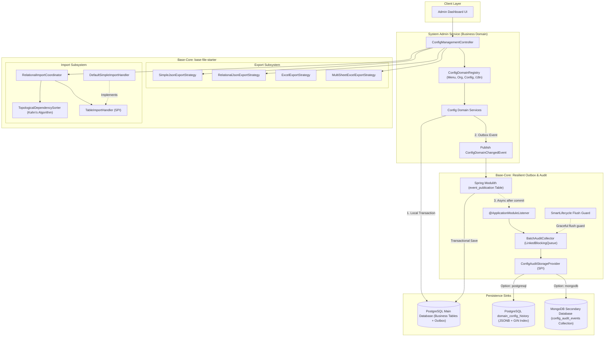

# Phân tích So sánh & Đánh giá Khoảng cách: Advanced Config Import/Export & Audit Framework

> Tổng hợp kết quả từ Open Source Discovery, Nghiên cứu Internet và Hiện trạng Mã nguồn của Dự án.
> Đưa ra quyết định kiến trúc, phân tích trade-off và ma trận so sánh chi tiết cho 3 vấn đề kiến trúc mở.

---

## 1. Tóm tắt (Executive Summary)

| Mục | Nội dung |
|-----|----------|
| **Tính năng** | Nền tảng Export/Import & Audit Versioning Nâng cao |
| **Ngày phân tích** | 2026-09-30 |
| **Quyết định Chủ đề 1** | **HYBRID ARCHITECTURE trong `base-core`**: Bổ sung `SimpleJsonExportStrategy<T>` (cho bảng phẳng) và `RelationalJsonExportStrategy` + Khung điều phối Import đa chế độ (`TableImportHandler`, `ImportStrategyMode`, Topological Sort) vào **`base-file-starter`**. Cung cấp `DefaultSimpleImportHandler` để tái sử dụng ngay lập tức cho 90% bảng cấu hình. |
| **Quyết định Chủ đề 2** | **TÁCH RIÊNG `MultiSheetExcelExportStrategy`**: Giữ nguyên `ExcelExportStrategy<T>` đơn sheet để đảm bảo 100% tương thích ngược và an toàn kiểu; tạo mới `MultiSheetExcelExportStrategy` tiếp nhận `MultiSheetExportTemplate` với cơ chế quản lý CellStyle Pool tập trung và sliding window O(1) RAM. |
| **Quyết định Chủ đề 3** | **SPRING MODULITH OUTBOX + MICRO-BATCH BUFFER + DUAL STORAGE SPI**: Sử dụng `@ApplicationModuleListener` phi đồng bộ, ghi nhận sự kiện vào bảng Outbox `event_publication` của PostgreSQL đảm bảo **Zero-loss durability**, gom batch trong RAM qua `BatchAuditCollector` (`SmartLifecycle`), và trừu tượng hóa `ConfigAuditStorageProvider` SPI hỗ trợ hoán đổi hoặc mở rộng sang MongoDB. |
| **Độ tin cậy (Confidence)** | **HIGH (95%)** — Tất cả giải pháp đều dựa trên các mẫu kiến trúc enterprise đã kiểm chứng (Enterprise Integration Patterns, Topological Sort, SXSSF POI, Spring Modulith). |

---

## 2. Ma trận So sánh & Phân tích Đánh đổi (Trade-off Analysis)

### 2.1 Chủ đề 1: `JsonExportStrategy` & Import Đồ thị Phức tạp — Base-core vs Service-specific

| Tiêu chí | Phương án 1: Viết Custom riêng trong `system-admin-service` | Phương án 2: Đưa toàn bộ vào `base-core` dạng cố định | Phương án 3: Khung Trừu tượng Đa tầng trong `base-file-starter` (CHỌN) |
|----------|:-----------------------------------------------------------:|:----------------------------------------------------:|:---------------------------------------------------------------------:|
| **Khả năng tái sử dụng (Reusability)** | ❌ Kém. Các service khác (`auth-service`, `account-service`) khi cần backup/migrate dữ liệu cũng phải tự viết lại. | ⚠️ Trung bình. Bị bó cứng vào cấu trúc bảng của `system-admin-service`, khó tùy biến. | ✅ **Tối đa**. Mọi microservice đều thừa hưởng chuẩn xuất/nhập JSON phẳng và đồ thị liên kết. |
| **Độ phức tạp mã nguồn (Code Boilerplate)** | Cao. Mỗi domain cấu hình phải tự viết luồng đọc file và xử lý tuần tự. | Cao nếu không có generic handler. | ✅ **Tối thiểu**. `DefaultSimpleImportHandler` giúp các bảng thông thường chỉ mất 2-3 dòng khai báo. |
| **Xử lý khóa ngoại (FK Dependency)** | Thủ công trong từng controller/service. | Cứng nhắc. | ✅ **Tự động hóa**. Thuật toán Kahn (Topological Sort) tự động xác định thứ tự nạp và xóa. |
| **Tính toàn vẹn (Integrity Checksum)** | Thường bị bỏ qua hoặc làm chắp vá. | Không nhất quán. | ✅ **Tiêu chuẩn hóa**. Xuất JSON kèm mã băm SHA-256 xác thực chống sửa đổi tệp backup trái phép. |

### 2.2 Chủ đề 2: Multi-sheet Excel Export — Mở rộng `ExcelExportStrategy` vs Tách biệt Strategy

| Tiêu chí | Phương án A: Sửa đổi `ExcelExportStrategy` hiện tại | Phương án B: Tách riêng `MultiSheetExcelExportStrategy` (CHỌN) |
|----------|:--------------------------------------------------:|:--------------------------------------------------------------:|
| **Nguyên lý OCP & SRP** | ❌ Vi phạm. Biến một lớp streaming đơn bảng thành lớp "God class" ôm đồm cả multi-sheet. | ✅ **Hoàn hảo**. Giữ nguyên vẹn mã nguồn cũ, bổ sung lớp mới mở rộng tính năng. |
| **An toàn kiểu (Type Safety)** | ❌ Kém. Interface `ExportStrategy<T>` yêu cầu `Stream<T>`. Multi-sheet gồm nhiều kiểu dữ liệu khác nhau nên phải ép kiểu thô `Any` hoặc `Object`. | ✅ **Rõ ràng**. `MultiSheetExportTemplate` chứa danh sách `SheetExportDefinition<*>`, mỗi tab có schema và data supplier riêng. |
| **Tương thích ngược (Backward Compatibility)** | ⚠️ Nguy cơ cao làm hỏng các luồng xuất đơn bảng đang hoạt động trên môi trường Production. | ✅ **100% An toàn**. Không làm thay đổi bất kỳ hành vi nào của `ExcelExportStrategy<T>`. |
| **Quản lý Style Pool & OOM** | Khó quản lý style chung giữa nhiều sheet nếu tái sử dụng hàm đơn. | ✅ **Kiểm soát chặt chẽ**. Khởi tạo Style Pool dùng chung trước khi duyệt qua các sheet, giải phóng RAM và file tạm trong khối `finally`. |

### 2.3 Chủ đề 3: `VersionedConfigDomain` Auto-Tracking & Durability — So sánh Cơ chế

| Phương thức | Hiệu năng CRUD chính | Khả năng mất mát dữ liệu (Durability) | Rủi ro Deadlock / Locking | Khả năng mở rộng Secondary Storage |
|-------------|:-------------------:|:------------------------------------:|:-------------------------:|:----------------------------------:|
| **Gọi thủ công trong Service** | ❌ Chậm. Thêm câu lệnh INSERT history đồng bộ trong cùng thread request. | Thấp (nằm trong TX chính). | Trung bình nếu ghi bảng to. | ❌ Rất khó (bó cứng với repository cục bộ). |
| **AOP thuần túy (`@Around`)** | ⚠️ Vẫn chặn thread người dùng; khó bắt chênh lệch (diff) chính xác nếu không clone entity. | ❌ Có nguy cơ mất nếu process bị kill trước khi aspect hoàn tất. | Trung bình. | ⚠️ Khó điều phối batch. |
| **Spring Modulith Outbox + Batch Buffer** (CHỌN) | ✅ **Cực nhanh**. Transaction chính chỉ lưu một bản ghi nhỏ vào `event_publication`. Listener chạy phi đồng bộ. | ✅ **Zero-loss tuyệt đối**. Sự kiện được ghi bền vững trước commit, tự động phát lại khi server khởi động lại. | ✅ **Không ảnh hưởng**. Tách biệt hoàn toàn luồng ghi lịch sử ra khỏi khóa bảng chính. | ✅ **Tối đa**. Dễ dàng gom batch ghi PostgreSQL hoặc MongoDB qua Storage SPI. |

---

## 3. Ma trận Tính năng (Feature Matrix)

| Tính năng cốt lõi | Hiện tại (Current Base) | Custom In-service | Giải pháp Đề xuất (Target Framework) | Độ ưu tiên |
|-------------------|:----------------------:|:-----------------:|:------------------------------------:|:----------:|
| **1. Xuất JSON phẳng (Streaming Array)** | ❌ Chưa có | ⚠️ Tạm thời | ✅ `SimpleJsonExportStrategy<T>` trong `base-file-starter` | ⭐ Must |
| **2. Xuất JSON đồ thị có Checksum SHA-256** | ❌ Chưa có | ⚠️ Trong web layer | ✅ `RelationalJsonExportStrategy` tiêu chuẩn | ⭐ Must |
| **3. Giải quyết thứ tự nạp khóa ngoại tự động** | ❌ Không | ❌ Thủ công | ✅ Thuật toán Topo (Kahn's DAG Sorter) | ⭐ Must |
| **4. Bốn chế độ Import (Truncate, Delete-Insert, Upsert, Patch)** | ❌ Không (chỉ CSV) | ⚠️ Khai báo enum | ✅ Khung điều phối `RelationalImportCoordinator` + `TableImportHandler` | ⭐ Must |
| **5. Default Import Handler giảm boilerplate** | ❌ Không | ⚠️ Viết thô | ✅ `DefaultSimpleImportHandler<T, ID>` kế thừa Spring Data JPA | ⭐ Must |
| **6. Xuất Excel nhiều Sheet tự động** | ❌ Không (chỉ 1 sheet) | ⚠️ Ghép thủ công | ✅ `MultiSheetExcelExportStrategy` + `MultiSheetExportTemplate` | ⭐ Must |
| **7. Quản lý CellStyle & Chống Formula Injection** | ⚠️ Cơ bản | ⚠️ Chưa có pool | ✅ Shared Style Pool + `ExportSanitizer` (CWE-1236) | ⭐ Must |
| **8. Auto-tracking phi đồng bộ không nghẽn CRUD** | ❌ Gọi đồng bộ | ⚠️ Listener cơ bản | ✅ `@ApplicationModuleListener` + Spring Modulith Outbox | ⭐ Must |
| **9. Micro-batching bộ nhớ RAM an toàn** | ❌ Không | ⚠️ Có Collector | ✅ `BatchAuditCollector` với `SmartLifecycle` (Phase 10,000) | ⭐ Must |
| **10. Khả năng cắm rút Dual Database (Postgres + MongoDB)** | ❌ Không | ⚠️ Chỉ Postgres | ✅ `ConfigAuditStorageProvider` SPI hỗ trợ MongoDB Document | ⭐ Must |

---

## 4. Gap Analysis tổng hợp

### 4.1 Hiện trạng hệ thống (Current) vs Hệ thống Mục tiêu (Target)

| Thành phần | Hiện trạng (Current System) | Hệ thống Mục tiêu (Target System) | Khoảng cách (Gap) | Mức độ tác động |
|------------|-----------------------------|-----------------------------------|-------------------|-----------------|
| **Base Core File Engine** | Chỉ có `ExcelExportStrategy` (1 sheet) và `CsvExportStrategy`. Thiếu JSON và multi-sheet. | Đầy đủ `SimpleJsonExportStrategy`, `RelationalJsonExportStrategy`, `MultiSheetExcelExportStrategy`. | Thiếu các strategy và enum `ExportFormat.JSON`. | 🔴 HIGH |
| **Import Abstraction** | `ImportService` chỉ đọc CSV, ném exception khi gặp file Excel, không hỗ trợ quan hệ bảng. | `TableImportHandler`, `DefaultSimpleImportHandler`, `RelationalImportCoordinator` tự động sort topo. | Thiếu kiến trúc nạp đa bảng và điều phối FK. | 🔴 HIGH |
| **Versioning & Audit Trail** | Ghi lịch sử đồng bộ vào PostgreSQL `domain_config_history`, nguy cơ chậm API và nghẽn I/O. | Event-driven Outbox phi đồng bộ + gom vi mẻ 100 bản ghi/500ms + Storage SPI. | Luồng ghi lịch sử chưa được chuẩn hóa, chưa có tùy chọn tách DB thứ cấp. | 🔴 HIGH |
| **Excel Memory & Security** | Tạo `CellStyle` phân tán, thiếu kiểm soát khi xuất nhiều domain cùng lúc. | Shared Style Pool, sliding window 100 dòng, `ExportSanitizer` chống injection. | Nguy cơ OOM và lỗ hổng bảo mật khi file lớn. | 🟡 MEDIUM |

---

## 5. Đề xuất Kiến trúc Chi tiết (Detailed Architectural Decision)

### Lý do lựa chọn kiến trúc này:
1. **Phân tầng rõ ràng (Separation of Concerns)**:
   - Các cơ chế generic kỹ thuật (streaming, topological sort, batch collector, SXSSF management) đặt tại `base-core` để tái sử dụng toàn bộ hệ sinh thái.
   - Các quy tắc nghiệp vụ cấu hình (lấy state, map trường, xử lý nghiệp vụ mốc) nằm tại `system-admin-service`.
2. **Bảo vệ luồng CRUD chính (Zero Latency Impact)**:
   - Thao tác sửa đổi cấu hình của người dùng hoàn tất ngay lập tức sau khi ghi entity chính và bản ghi outbox siêu nhẹ. Toàn bộ logic diffing, gom mẻ và ghi audit chạy hoàn toàn ngầm ở background thread.
3. **Chống thất thoát dữ liệu 100% (Zero-loss Guarantee)**:
   - Nhờ cơ chế `event_publication` của Spring Modulith kết hợp `SmartLifecycle` xả bộ đệm trước khi tắt ứng dụng, không có bản ghi nào bị rơi rớt khi tải cao hoặc khi khởi động lại dịch vụ.
4. **Mở rộng lưu trữ linh hoạt (Storage Agnostic)**:
   - Cho phép các hệ thống quy mô nhỏ dùng PostgreSQL JSONB để tiết kiệm hạ tầng; khi dữ liệu phình to chỉ cần bật cấu hình `mongodb` để chuyển toàn bộ tải lịch sử sang cơ sở dữ liệu NoSQL mà không cần sửa một dòng mã nghiệp vụ nào.

---

## 6. Đánh giá Rủi ro & Giải pháp Giảm thiểu (Risk Assessment)

| Rủi ro kỹ thuật | Xác suất | Tác động | Giải pháp giảm thiểu (Mitigation Strategy) |
|-----------------|:---:|:---:|--------------------------------------------|
| **1. Tràn bộ nhớ (OOM) khi xuất file Excel/JSON khổng lồ** | Trung bình | Cao | Bắt buộc áp dụng `SXSSFWorkbook(100)` và Jackson `JsonGenerator` streaming trực tiếp ra `OutputStream`. Không bao giờ load toàn bộ list vào RAM. |
| **2. Giới hạn CellStyle tối đa (64k styles) của Apache POI** | Thấp | Cao | Sử dụng Style Cache tập trung dùng chung cho toàn bộ workbook thay vì tạo mới ở từng ô/dòng. |
| **3. Lỗ hổng Formula Injection (CWE-1236) trong tệp Excel/CSV** | Trung bình | Cao | Tích hợp `ExportSanitizer` tự động prefix dấu nháy đơn `'` cho mọi ô có ký tự nhạy cảm (`=`, `+`, `-`, `@`, `\t`, `\r`). |
| **4. Mất mát sự kiện audit khi máy chủ crash đột ngột** | Thấp | Nghiêm trọng | Kích hoạt `spring.modulith.republish-outstanding-events-on-restart=true` để phục hồi tự động từ bảng outbox `event_publication`. |
| **5. Deadlock hoặc xung đột khóa ngoại khi Import đa bảng** | Trung bình | Cao | Sử dụng thuật toán Kahn để sắp xếp đúng thứ tự phụ thuộc (cha trước, con sau). Khi cần thiết bật `SET CONSTRAINTS ALL DEFERRED` trong transaction. |

---

## 7. Ước tính Khối lượng & Độ phức tạp triển khai

| Gói công việc | Độ phức tạp | Ước lượng Effort | Ghi chú |
|---------------|:-----------:|:----------------:|---------|
| **Khung Export Base-core** (`SimpleJsonExportStrategy`, `RelationalJsonExportStrategy`, `MultiSheetExcelExportStrategy`) | Trung bình | 2 developer-days | Đưa vào `base-file-starter`, viết unit tests kiểm tra streaming & style pool |
| **Khung Import Base-core** (`TableImportHandler`, `DefaultSimpleImportHandler`, Kahn's Topo Sorter) | Trung bình | 2.5 developer-days | Đưa vào `base-file-starter`, kiểm thử với quan hệ đa tầng |
| **Outbox Audit & Dual Storage Engine** (`BatchAuditCollector`, `ConfigAuditStorageProvider`, MongoDB Provider) | Trung bình - Cao | 3 developer-days | Hoàn thiện lifecycle flush và testcontainer kiểm tra khả năng phục hồi khi restart |
| **Tích hợp vào System Admin Service** (Đăng ký domain handlers, cấu hình controller) | Thấp - Trung bình | 1.5 developer-days | Đấu nối với Menu, Organization, Feature Flags, Config Common |

---

> **Nguồn dữ liệu đối chiếu**:
> - [research_brief.md](./research_brief.md)
> - [opensource_findings.md](./opensource_findings.md)
> - [web_research.md](./web_research.md)
>
> **Bước tiếp theo**: Xây dựng Tài liệu Phân tích Nghiệp vụ chi tiết (`business_analysis.md`).
