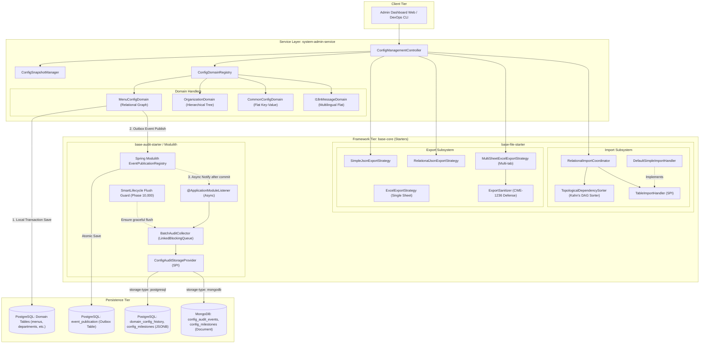
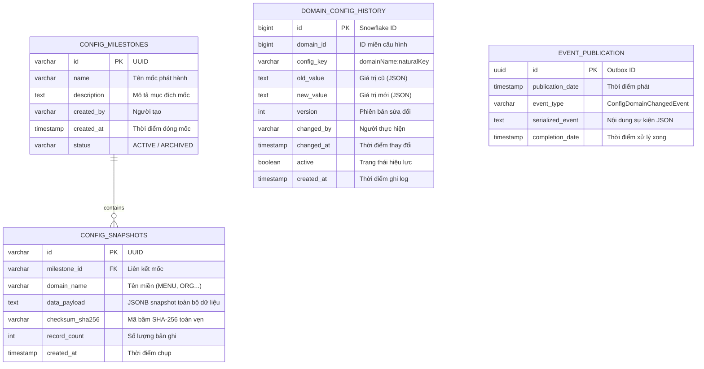
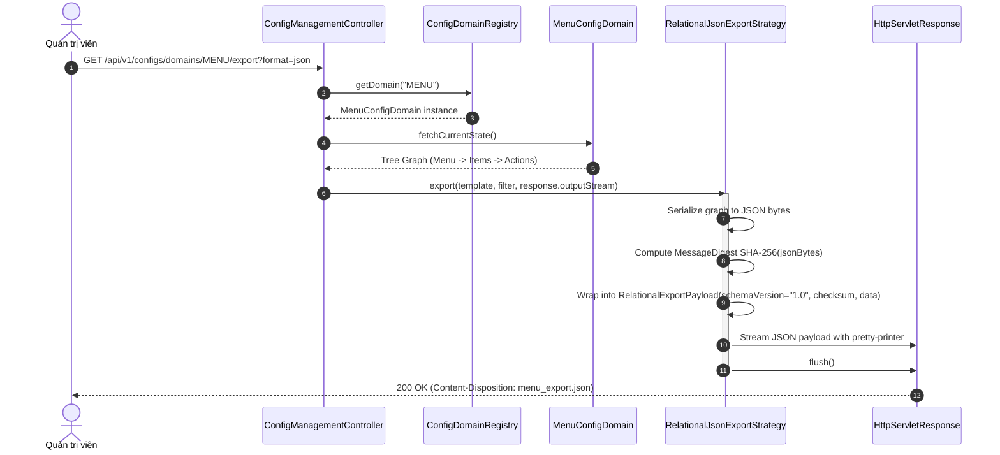
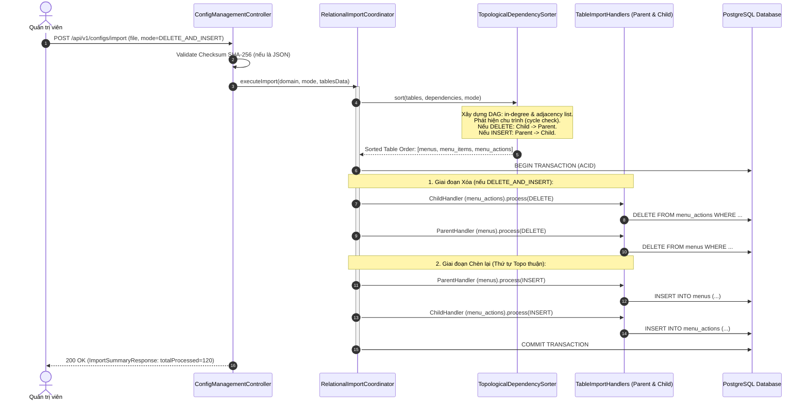
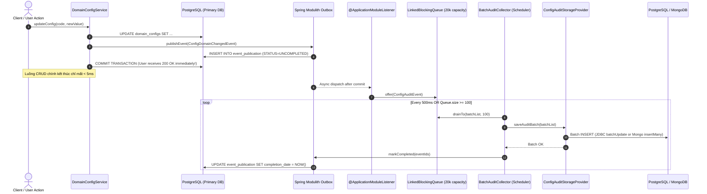

# Đặc tả Kỹ thuật: Advanced Config Import/Export & Audit Framework

> Technical specification chi tiết — đặc tả kiến trúc lớp, lược đồ cơ sở dữ liệu, thuật toán sắp xếp topo, luồng dữ liệu tuần tự và hướng dẫn triển khai mã nguồn chi tiết cho AI Agent.

---

## 1. Tổng quan Kiến trúc Hệ thống (System Overview)

### 1.1 Kiến trúc Phân tầng & Thành phần



### 1.2 Technology Stack

| Layer | Technology | Version | Ghi chú |
|-------|-----------|---------|---------|
| **Language** | Kotlin (JVM) / Java | 2.1+ / Java 21 LTS | Hỗ trợ Virtual Threads |
| **Framework** | Spring Boot | 3.4+ / 4.x Ready | Core runtime |
| **Modularity & Outbox** | Spring Modulith Starter JPA | 1.3+ | Transactional Outbox tự động |
| **Excel Engine** | Apache POI OOXML (SXSSF) | 5.3.0 | Sliding window 100 dòng, O(1) RAM |
| **JSON Engine** | Jackson Core / Databind | 2.18+ | Streaming JsonGenerator |
| **Primary Database** | PostgreSQL | 16+ | Cột JSONB, GIN Indexing, Outbox Table |
| **Secondary Database** | MongoDB | 7.0+ | Tùy chọn lưu trữ lịch sử kiểm toán khối lượng lớn |
| **Cache & Invalidation** | Redis | 7.2+ | Invalidate cache khi Rollback |

---

## 2. Lược đồ Dữ liệu (Data Schema)

### 2.1 Sơ đồ Quan hệ Thực thể (ERD)



### 2.2 Đặc tả Bảng Chi tiết (PostgreSQL DDL)

#### Bảng `config_milestones`
| Cột | Kiểu dữ liệu | Ràng buộc | Mô tả |
|-----|-------------|-----------|-------|
| `id` | `VARCHAR(36)` | PK | UUID định danh mốc |
| `name` | `VARCHAR(100)` | NOT NULL | Tên mốc cấu hình (VD: `Sprint-42-Release`) |
| `description` | `TEXT` | NULLABLE | Mô tả chi tiết các thay đổi trong mốc |
| `created_by` | `VARCHAR(50)` | NOT NULL | Username của người tạo mốc |
| `created_at` | `TIMESTAMP WITH TIME ZONE` | NOT NULL | Thời điểm tạo mốc (UTC) |
| `status` | `VARCHAR(20)` | NOT NULL DEFAULT `'ACTIVE'` | Trạng thái mốc (`ACTIVE`, `ARCHIVED`) |

#### Bảng `config_snapshots`
| Cột | Kiểu dữ liệu | Ràng buộc | Mô tả |
|-----|-------------|-----------|-------|
| `id` | `VARCHAR(36)` | PK | UUID định danh snapshot |
| `milestone_id` | `VARCHAR(36)` | FK -> `config_milestones(id)` | Khóa ngoại trỏ về mốc tương ứng |
| `domain_name` | `VARCHAR(50)` | NOT NULL | Tên miền cấu hình (VD: `MENU`, `COMMON_CONFIG`) |
| `data_payload` | `JSONB` | NOT NULL | Snapshot dữ liệu JSONB toàn diện |
| `checksum_sha256` | `VARCHAR(64)` | NOT NULL | Mã băm SHA-256 bảo toàn dữ liệu |
| `record_count` | `INT` | NOT NULL DEFAULT 0 | Tổng số bản ghi trong snapshot |
| `created_at` | `TIMESTAMP WITH TIME ZONE` | NOT NULL | Thời điểm tạo snapshot |

**Chỉ mục:**
- `idx_config_snapshots_milestone`: `milestone_id` (BTREE)
- `idx_config_snapshots_domain`: `domain_name, created_at DESC` (BTREE)
- `idx_config_snapshots_payload_gin`: `data_payload` (GIN Indexing cho truy vấn JSONB)

#### Bảng `domain_config_history`
| Cột | Kiểu dữ liệu | Ràng buộc | Mô tả |
|-----|-------------|-----------|-------|
| `id` | `BIGINT` | PK | Snowflake ID |
| `domain_id` | `BIGINT` | NOT NULL DEFAULT 0 | ID miền cấu hình |
| `config_key` | `VARCHAR(255)` | NOT NULL | Key định danh bản ghi (`<domain>:<key>`) |
| `old_value` | `TEXT` | NULLABLE | Trạng thái trước khi sửa (JSON) |
| `new_value` | `TEXT` | NULLABLE | Trạng thái sau khi sửa (JSON) |
| `version` | `INT` | NOT NULL DEFAULT 1 | Số phiên bản tăng dần |
| `changed_by` | `VARCHAR(50)` | NOT NULL | Username người thực hiện |
| `changed_at` | `TIMESTAMP WITH TIME ZONE` | NOT NULL | Thời điểm thay đổi |
| `active` | `BOOLEAN` | NOT NULL DEFAULT TRUE | Trạng thái hiệu lực |
| `created_at` | `TIMESTAMP WITH TIME ZONE` | NOT NULL | Thời điểm chèn log |

**Chỉ mục:**
- `idx_config_history_key_time`: `config_key, changed_at DESC` (BTREE để tra cứu nhanh 5 lần sửa đổi gần nhất)

### 2.3 Lược đồ Tài liệu MongoDB (Secondary Storage Option)

Khi kích hoạt `app.config.audit.storage-type: mongodb`, các thực thể được ánh xạ vào MongoDB collections:

#### Collection `config_audit_events`
```json
{
  "_id": "6704b2c8a1e2f3456789abcd",
  "eventId": "3c98f821-6a23-41a4-921b-8fbc9238914b",
  "domainName": "MENU",
  "naturalKey": "/admin/dashboard",
  "action": "UPDATE",
  "previousState": { "icon": "old-icon", "sortOrder": 1 },
  "newState": { "icon": "new-icon", "sortOrder": 2 },
  "changedBy": "admin_user",
  "changedAt": ISODate("2026-09-30T10:15:30.000Z"),
  "metadata": {
    "ipAddress": "192.168.1.100",
    "userAgent": "Mozilla/5.0..."
  }
}
```
**Chỉ mục MongoDB:**
- `{ domainName: 1, naturalKey: 1, changedAt: -1 }` (Tra cứu lịch sử một cấu hình)
- `{ changedAt: -1 }` (Phân trang tổng thể)
- `{ "metadata.ipAddress": 1 }` (Phục vụ truy vết an ninh)

---

## 3. Luồng Xử lý Tuần tự (Sequence Diagrams)

### 3.1 Luồng 1: Xuất JSON Đồ thị Quan hệ Kèm Checksum SHA-256



### 3.2 Luồng 2: Nạp Cấu hình Đa bảng với Thuật toán Sắp xếp Topo (Kahn's Algorithm)



### 3.3 Luồng 3: Non-blocking Outbox Event Audit & Micro-batching với Dual-Storage



---

## 4. Đặc tả Thuật toán & Mã nguồn Hướng dẫn AI Agent (Agent Implementation Notes)

> **Phần bắt buộc dành cho AI Agent:** Định nghĩa chính xác cấu trúc gói (packages), tên lớp (classes), interface contract và mã nguồn mẫu để dev trực tiếp.

### 4.1 Khung Export Đồ thị Quan hệ (`base-file-starter`)

#### Enum `ExportFormat` (Cập nhật trong `base-core` model)
*File:* `components/base-core/src/main/kotlin/com/ntt/basecore/domain/file/ExportStrategy.kt`
```kotlin
enum class ExportFormat(val extension: String, val contentType: String) {
    CSV("csv", "text/csv"),
    EXCEL("xlsx", "application/vnd.openxmlformats-officedocument.spreadsheetml.sheet"),
    JSON("json", "application/json") // BỔ SUNG
}
```

#### Contract `RelationalExportTemplate` & Payload
*File:* `components/base-core/starters/base-file-starter/src/main/kotlin/com/ntt/basecore/autoconfigure/file/export/RelationalJsonExportStrategy.kt`
```kotlin
package com.ntt.basecore.autoconfigure.file.export

import com.fasterxml.jackson.databind.ObjectMapper
import java.io.OutputStream
import java.security.MessageDigest
import java.time.Instant

/**
 * Interface cho các domain có dữ liệu đồ thị phức tạp (VD: Menu + Items + Actions).
 */
interface RelationalExportTemplate<R : Any> {
    val templateId: String
    val domainName: String
    val schemaVersion: String get() = "1.0"
    fun extractGraph(filter: Map<String, Any>? = null): R
}

/**
 * Thùng chứa (Container) chuẩn hóa có chữ ký kiểm tra tính toàn vẹn.
 */
data class RelationalExportPayload<R : Any>(
    val schemaVersion: String,
    val domainName: String,
    val exportedAt: Instant,
    val checksumSha256: String,
    val data: R
)

/**
 * Strategy xuất JSON đồ thị quan hệ hỗ trợ tính SHA-256 Checksum tự động.
 */
class RelationalJsonExportStrategy(
    private val objectMapper: ObjectMapper
) {
    fun <R : Any> export(template: RelationalExportTemplate<R>, filter: Map<String, Any>?, output: OutputStream) {
        val graphData = template.extractGraph(filter)
        val dataJsonBytes = objectMapper.writeValueAsBytes(graphData)

        // Tính toán mã băm SHA-256
        val digest = MessageDigest.getInstance("SHA-256")
        val hashBytes = digest.digest(dataJsonBytes)
        val checksumHex = hashBytes.joinToString("") { "%02x".format(it) }

        val payload = RelationalExportPayload(
            schemaVersion = template.schemaVersion,
            domainName = template.domainName,
            exportedAt = Instant.now(),
            checksumSha256 = checksumHex,
            data = graphData
        )

        objectMapper.writerWithDefaultPrettyPrinter().writeValue(output, payload)
        output.flush()
    }
}
```

---

### 4.2 Khung Xuất Excel Nhiều Sheet Độc lập (`MultiSheetExcelExportStrategy`)

*File:* `components/base-core/starters/base-file-starter/src/main/kotlin/com/ntt/basecore/autoconfigure/file/export/MultiSheetExcelExportStrategy.kt`
```kotlin
package com.ntt.basecore.autoconfigure.file.export

import com.ntt.basecore.domain.file.ColumnDefinition
import org.apache.poi.ss.usermodel.CellStyle
import org.apache.poi.ss.usermodel.FillPatternType
import org.apache.poi.ss.usermodel.IndexedColors
import org.apache.poi.xssf.streaming.SXSSFWorkbook
import java.io.OutputStream
import java.util.stream.Stream

data class SheetExportDefinition<T : Any>(
    val sheetName: String,
    val columns: List<ColumnDefinition>,
    val dataSupplier: () -> Stream<T>
)

interface MultiSheetExportTemplate {
    val templateId: String
    fun sheets(filter: Map<String, Any>? = null): List<SheetExportDefinition<*>>
}

class MultiSheetExcelExportStrategy {

    companion object {
        private const val WINDOW_SIZE = 100 // Duy trì cố định 100 dòng trên RAM
    }

    fun export(template: MultiSheetExportTemplate, filter: Map<String, Any>?, output: OutputStream) {
        val workbook = SXSSFWorkbook(WINDOW_SIZE)
        try {
            // 1. Quản lý Style Pool tập trung (Tránh giới hạn 64k styles của POI)
            val styles = createSharedStyles(workbook)

            val sheetDefinitions = template.sheets(filter)
            sheetDefinitions.forEach { sheetDef ->
                writeSheet(workbook, sheetDef, styles)
            }

            workbook.write(output)
            output.flush()
        } finally {
            // 2. Bắt buộc dọn dẹp file tạm trên đĩa để tránh Disk Full
            workbook.dispose()
            workbook.close()
        }
    }

    private fun createSharedStyles(workbook: SXSSFWorkbook): Map<String, CellStyle> {
        val headerFont = workbook.createFont().apply {
            bold = true
            color = IndexedColors.WHITE.index
        }
        val headerStyle = workbook.createCellStyle().apply {
            setFont(headerFont)
            fillForegroundColor = IndexedColors.DARK_BLUE.index
            fillPattern = FillPatternType.SOLID_FOREGROUND
        }
        return mapOf("HEADER" to headerStyle)
    }

    private fun <T : Any> writeSheet(
        workbook: SXSSFWorkbook,
        sheetDef: SheetExportDefinition<T>,
        styles: Map<String, CellStyle>
    ) {
        val sheet = workbook.createSheet(sheetDef.sheetName)
        
        // Tạo hàng tiêu đề
        val headerRow = sheet.createRow(0)
        sheetDef.columns.forEachIndexed { index, col ->
            val cell = headerRow.createCell(index)
            cell.setCellValue(col.header)
            cell.cellStyle = styles["HEADER"]
            col.width?.let { sheet.setColumnWidth(index, it * 256) }
        }

        // Stream từng dòng dữ liệu từ cursor
        var rowIndex = 1
        sheetDef.dataSupplier().use { stream ->
            stream.forEach { item ->
                val row = sheet.createRow(rowIndex++)
                sheetDef.columns.forEachIndexed { colIndex, col ->
                    val cell = row.createCell(colIndex)
                    val value = extractFieldValue(item, col.field)
                    when (value) {
                        is Number -> cell.setCellValue(value.toDouble())
                        is Boolean -> cell.setCellValue(value)
                        null -> cell.setCellValue("")
                        // Phòng chống tấn công Formula Injection (CWE-1236)
                        else -> cell.setCellValue(ExportSanitizer.sanitize(value).toString())
                    }
                }
            }
        }
    }

    private fun extractFieldValue(item: Any?, fieldName: String): Any? {
        if (item == null) return null
        return try {
            val field = item::class.java.getDeclaredField(fieldName)
            field.isAccessible = true
            field.get(item)
        } catch (e: NoSuchFieldException) {
            try {
                val getter = item::class.java.getMethod("get${fieldName.replaceFirstChar { it.uppercase() }}")
                getter.invoke(item)
            } catch (e2: Exception) {
                null
            }
        }
    }
}
```

---

### 4.3 Khung Import Đồ thị Quan hệ & Thuật toán Kahn (`base-file-starter`)

#### Thuật toán Topological Dependency Sorter (Kahn's Algorithm)
*File:* `components/base-core/starters/base-file-starter/src/main/kotlin/com/ntt/basecore/autoconfigure/file/import/TopologicalDependencySorter.kt`
```kotlin
package com.ntt.basecore.autoconfigure.file.import

class TopologicalDependencySorter {

    /**
     * Sắp xếp danh sách bảng theo thứ tự phụ thuộc khóa ngoại.
     * @param tables Danh sách tên bảng cần nạp
     * @param dependencies Map<TênBảng, DanhSáchBảngPhụThuộc> (Bảng A trỏ FK tới Bảng B => dependencies[A] chứa B)
     * @param reverseOrder Nếu true (dành cho thao tác DELETE): Bảng con xóa trước, bảng cha xóa sau.
     */
    fun sort(
        tables: List<String>,
        dependencies: Map<String, List<String>>,
        reverseOrder: Boolean = false
    ): List<String> {
        val inDegree = mutableMapOf<String, Int>().withDefault { 0 }
        val adjList = mutableMapOf<String, MutableList<String>>()

        tables.forEach { table ->
            adjList[table] = mutableListOf()
            inDegree[table] = 0
        }

        // Xây dựng đồ thị có hướng: Parent -> Child (Đỉnh phụ thuộc phải được chèn trước)
        for ((dependent, deps) in dependencies) {
            if (!tables.contains(dependent)) continue
            for (dependency in deps) {
                if (tables.contains(dependency)) {
                    adjList[dependency]?.add(dependent)
                    inDegree[dependent] = inDegree.getValue(dependent) + 1
                }
            }
        }

        // Hàng đợi các đỉnh có in-degree = 0 (Không phụ thuộc bảng nào)
        val queue = ArrayDeque<String>()
        tables.forEach { if (inDegree.getValue(it) == 0) queue.add(it) }

        val sortedOrder = mutableListOf<String>()
        while (queue.isNotEmpty()) {
            val current = queue.removeFirst()
            sortedOrder.add(current)

            for (neighbor in adjList[current] ?: emptyList()) {
                inDegree[neighbor] = inDegree.getValue(neighbor) - 1
                if (inDegree.getValue(neighbor) == 0) {
                    queue.add(neighbor)
                }
            }
        }

        if (sortedOrder.size != tables.size) {
            throw IllegalStateException("Phát hiện phụ thuộc vòng (Circular Dependency) giữa các bảng: $tables")
        }

        return if (reverseOrder) sortedOrder.reversed() else sortedOrder
    }
}
```

#### Lớp Mẫu `DefaultSimpleImportHandler<T, ID>` (Tối giản 90% Code)
*File:* `components/base-core/starters/base-file-starter/src/main/kotlin/com/ntt/basecore/autoconfigure/file/import/DefaultSimpleImportHandler.kt`
```kotlin
package com.ntt.basecore.autoconfigure.file.import

import org.springframework.data.jpa.repository.JpaRepository

/**
 * Handler mẫu mặc định cho 90% các bảng cấu hình phẳng.
 * Developer chỉ cần kế thừa lớp này và truyền Spring Data JpaRepository tương ứng.
 */
open class DefaultSimpleImportHandler<T : Any, ID : Any>(
    override val tableName: String,
    protected val repository: JpaRepository<T, ID>,
    override val order: Int = 0
) : TableImportHandler<T> {

    override fun process(records: List<T>, context: ImportContext) {
        when (context.mode) {
            ImportStrategyMode.TRUNCATE_AND_LOAD,
            ImportStrategyMode.DELETE_AND_INSERT -> {
                repository.deleteAllInBatch()
                repository.saveAll(records)
            }
            ImportStrategyMode.UPSERT_MERGE,
            ImportStrategyMode.PATCH_VALUES -> {
                repository.saveAll(records)
            }
        }
    }
}
```

---

### 4.4 Kiến trúc Audit Outbox & Micro-Batching (`system-admin-service` / `base-audit-starter`)

#### Bộ đệm vi mẻ `BatchAuditCollector` với `SmartLifecycle`
*File:* `services/system-admin-service/src/main/kotlin/com/ntt/sysadmin/versioning/buffer/BatchAuditCollector.kt`
```kotlin
package com.ntt.sysadmin.versioning.buffer

import com.ntt.sysadmin.versioning.storage.ConfigAuditEvent
import com.ntt.sysadmin.versioning.storage.ConfigAuditStorageProvider
import org.slf4j.LoggerFactory
import org.springframework.beans.factory.DisposableBean
import org.springframework.context.SmartLifecycle
import org.springframework.stereotype.Component
import java.util.ArrayList
import java.util.concurrent.*
import java.util.concurrent.atomic.AtomicBoolean

@Component
class BatchAuditCollector(
    private val storageProvider: ConfigAuditStorageProvider
) : SmartLifecycle, DisposableBean {

    private val log = LoggerFactory.getLogger(javaClass)

    companion object {
        const val BATCH_SIZE = 100
        const val FLUSH_INTERVAL_MS = 500L
        const val MAX_CAPACITY = 20_000
    }

    private val queue = LinkedBlockingQueue<ConfigAuditEvent>(MAX_CAPACITY)
    private val isRunning = AtomicBoolean(false)
    private var scheduler: ScheduledExecutorService? = null

    fun enqueue(event: ConfigAuditEvent): Boolean {
        val offered = queue.offer(event)
        if (!offered) {
            log.warn("Hàng đợi audit đầy! Tự động fallback lưu đồng bộ khẩn cấp.")
            try {
                storageProvider.saveAuditBatch(listOf(event))
            } catch (ex: Exception) {
                log.error("Lỗi khi lưu đồng bộ audit event khẩn cấp", ex)
            }
            return false
        }

        if (queue.size >= BATCH_SIZE) {
            triggerAsyncFlush()
        }
        return true
    }

    @Synchronized
    fun flush(): Int {
        if (queue.isEmpty()) return 0
        val batch = ArrayList<ConfigAuditEvent>(BATCH_SIZE)
        queue.drainTo(batch, BATCH_SIZE)

        if (batch.isNotEmpty()) {
            try {
                storageProvider.saveAuditBatch(batch)
                log.debug("Đã xả thành công {} sự kiện audit xuống kho lưu trữ", batch.size)
            } catch (ex: Exception) {
                log.error("Lỗi khi xả batch audit event", ex)
            }
        }
        return batch.size
    }

    @Synchronized
    fun flushAll(): Int {
        var total = 0
        while (queue.isNotEmpty()) {
            val batch = ArrayList<ConfigAuditEvent>(BATCH_SIZE)
            queue.drainTo(batch, BATCH_SIZE)
            if (batch.isNotEmpty()) {
                storageProvider.saveAuditBatch(batch)
                total += batch.size
            }
        }
        log.info("FlushAll hoàn tất: đã lưu an toàn {} sự kiện trước khi tắt ứng dụng", total)
        return total
    }

    private fun triggerAsyncFlush() {
        scheduler?.execute { flush() }
    }

    override fun start() {
        if (isRunning.compareAndSet(false, true)) {
            val threadFactory = ThreadFactory { r ->
                Thread(r, "batch-audit-collector").apply { isDaemon = true }
            }
            scheduler = Executors.newSingleThreadScheduledExecutor(threadFactory)
            scheduler?.scheduleWithFixedDelay(
                { flush() },
                FLUSH_INTERVAL_MS,
                FLUSH_INTERVAL_MS,
                TimeUnit.MILLISECONDS
            )
            log.info("BatchAuditCollector đã khởi động (BatchSize={}, Interval={}ms)", BATCH_SIZE, FLUSH_INTERVAL_MS)
        }
    }

    override fun stop() {
        if (isRunning.compareAndSet(true, false)) {
            log.info("Dừng BatchAuditCollector, kích hoạt flushAll xả toàn bộ bộ đệm...")
            try {
                flushAll()
            } finally {
                scheduler?.shutdown()
            }
        }
    }

    override fun isRunning(): Boolean = isRunning.get()
    override fun isAutoStartup(): Boolean = true

    /**
     * Mức ưu tiên Phase 10,000 đảm bảo component này flush xong TRƯỚC KHI Spring đóng DataSource.
     */
    override fun getPhase(): Int = 10_000

    override fun destroy() {
        stop()
    }
}
```

---

### 4.5 Cấu hình Mở rộng Dual Database (PostgreSQL + MongoDB)

#### Storage SPI Contract
*File:* `services/system-admin-service/src/main/kotlin/com/ntt/sysadmin/versioning/storage/ConfigAuditStorageProvider.kt`
```kotlin
interface ConfigAuditStorageProvider {
    fun saveSnapshot(snapshot: ConfigSnapshotEntity): ConfigSnapshotEntity
    fun findSnapshotById(id: String): ConfigSnapshotEntity?
    fun findSnapshotsByMilestoneId(milestoneId: String): List<ConfigSnapshotEntity>
    fun findLatestSnapshot(domainName: String): ConfigSnapshotEntity?
    fun findSnapshotsByDomain(domainName: String, limit: Int): List<ConfigSnapshotEntity>
    fun saveMilestone(milestone: ConfigMilestoneEntity): ConfigMilestoneEntity
    fun findMilestoneById(id: String): ConfigMilestoneEntity?
    fun findAllMilestones(): List<ConfigMilestoneEntity>
    fun saveAuditBatch(events: List<ConfigAuditEvent>)
    fun findAuditHistory(domainName: String, naturalKey: String, limit: Int = 5): List<ConfigAuditEvent>
}
```

#### MongoDB Audit Storage Provider (Extensible Secondary Storage)
*File:* `services/system-admin-service/src/main/kotlin/com/ntt/sysadmin/versioning/storage/MongoAuditStorageProvider.kt`
```kotlin
package com.ntt.sysadmin.versioning.storage

import org.springframework.boot.autoconfigure.condition.ConditionalOnProperty
import org.springframework.data.mongodb.core.MongoTemplate
import org.springframework.data.mongodb.core.query.Criteria
import org.springframework.data.mongodb.core.query.Query
import org.springframework.stereotype.Component

@Component
@ConditionalOnProperty(name = ["app.config.audit.storage-type"], havingValue = "mongodb")
class MongoAuditStorageProvider(
    private val mongoTemplate: MongoTemplate
) : ConfigAuditStorageProvider {

    override fun saveAuditBatch(events: List<ConfigAuditEvent>) {
        if (events.isEmpty()) return
        mongoTemplate.insert(events, "config_audit_events")
    }

    override fun findAuditHistory(domainName: String, naturalKey: String, limit: Int): List<ConfigAuditEvent> {
        val query = Query(
            Criteria.where("domainName").`is`(domainName)
                .and("naturalKey").`is`(naturalKey)
        ).limit(limit)
        return mongoTemplate.find(query, ConfigAuditEvent::class.java, "config_audit_events")
    }

    // Các hàm snapshot & milestone chuyển đổi sang Mongo collections tương tự
    override fun saveSnapshot(snapshot: ConfigSnapshotEntity): ConfigSnapshotEntity {
        mongoTemplate.save(snapshot, "config_snapshots")
        return snapshot
    }

    override fun findSnapshotById(id: String): ConfigSnapshotEntity? =
        mongoTemplate.findById(id, ConfigSnapshotEntity::class.java, "config_snapshots")

    override fun findSnapshotsByMilestoneId(milestoneId: String): List<ConfigSnapshotEntity> =
        mongoTemplate.find(Query(Criteria.where("milestoneId").`is`(milestoneId)), ConfigSnapshotEntity::class.java, "config_snapshots")

    override fun findLatestSnapshot(domainName: String): ConfigSnapshotEntity? =
        mongoTemplate.findOne(Query(Criteria.where("domainName").`is`(domainName)).limit(1), ConfigSnapshotEntity::class.java, "config_snapshots")

    override fun findSnapshotsByDomain(domainName: String, limit: Int): List<ConfigSnapshotEntity> =
        mongoTemplate.find(Query(Criteria.where("domainName").`is`(domainName)).limit(limit), ConfigSnapshotEntity::class.java, "config_snapshots")

    override fun saveMilestone(milestone: ConfigMilestoneEntity): ConfigMilestoneEntity {
        mongoTemplate.save(milestone, "config_milestones")
        return milestone
    }

    override fun findMilestoneById(id: String): ConfigMilestoneEntity? =
        mongoTemplate.findById(id, ConfigMilestoneEntity::class.java, "config_milestones")

    override fun findAllMilestones(): List<ConfigMilestoneEntity> =
        mongoTemplate.findAll(ConfigMilestoneEntity::class.java, "config_milestones")
}
```

---

## 5. Danh mục REST API Specification

| Endpoint | HTTP Method | Mô tả chức năng | Quyền yêu cầu | Format Response |
|----------|:-----------:|-----------------|:-------------:|:---------------:|
| `/api/v1/configs/domains/{domain}/export` | `GET` | Xuất dữ liệu miền cấu hình (JSON hoặc Excel đơn) | `CONFIG_EXPORT` | Stream Attachment |
| `/api/v1/configs/export/all` | `GET` | Xuất toàn bộ miền cấu hình vào 1 file Excel đa sheet | `CONFIG_EXPORT` | .xlsx Attachment |
| `/api/v1/configs/import` | `POST` | Nạp dữ liệu cấu hình theo chính sách (Multipart File) | `CONFIG_IMPORT` | `ImportSummaryResponse` |
| `/api/v1/configs/milestones` | `POST` | Đóng gói mốc cấu hình (Milestone Snapshot) | `CONFIG_MANAGE` | `MilestoneResponse` |
| `/api/v1/configs/milestones` | `GET` | Danh sách các mốc cấu hình đã tạo | `CONFIG_VIEW` | `List<MilestoneResponse>` |
| `/api/v1/configs/domains/{domain}/diff` | `GET` | So sánh khác biệt giữa cấu hình hiện tại và snapshot | `CONFIG_VIEW` | `ConfigDiffResponse` |
| `/api/v1/configs/snapshots/{id}/rollback` | `POST` | Hoàn tác cấu hình về trạng thái snapshot | `CONFIG_MANAGE` | `RollbackResponse` |
| `/api/v1/configs/domains/{domain}/history` | `GET` | Xem 5 lần thay đổi gần nhất của 1 cấu hình cụ thể | `CONFIG_VIEW` | `List<ConfigAuditEvent>` |

---

## 6. Kế hoạch Kiểm thử & Ca kiểm thử Tiêu biểu (Test Cases)

| # | Tên Test Case | Loại Test | Kịch bản kiểm thử | Kết quả mong đợi |
|---|---------------|-----------|-------------------|------------------|
| **TC-01** | Topological Sort Parent-Child | Unit Test | Đưa vào 3 bảng Menu, Items, Actions với quan hệ FK lồng nhau | Thứ tự chèn: `[menus, menu_items, menu_actions]`. Thứ tự xóa: đảo ngược. |
| **TC-02** | Circular Dependency Detection | Unit Test | Đưa vào 2 bảng trỏ FK lẫn nhau (A -> B, B -> A) | Ném `IllegalStateException("Phát hiện phụ thuộc vòng")`. |
| **TC-03** | Relational JSON Export & Checksum | Integration | Xuất cây Menu đầy đủ ra JSON | Tệp JSON có trường `checksumSha256` khớp chính xác với SHA-256 của `data`. |
| **TC-04** | Multi-Sheet Excel Memory Leak Check | Performance | Xuất 50,000 dòng trên 4 sheet liên tiếp | RAM heap tăng không quá 50MB; tệp `.poi-sxssf-sheet*.xml` bị xóa sạch sau khi xong. |
| **TC-05** | Formula Injection Neutralization | Unit Test | Dữ liệu chứa chuỗi `=CMD\|' /C calc'!A0` | Ô Excel được xuất ra bắt đầu bằng `'=CMD...` (đã sanitize). |
| **TC-06** | Zero-loss Durability on Crash | Integration (Testcontainers) | Đẩy 1,000 sự kiện vào queue, giả lập ngắt ứng dụng | `SmartLifecycle` xả sạch hàng đợi; các event dở dang trong Outbox được tự động replay khi restart. |
| **TC-07** | Dual Database Routing Test | Integration | Đổi `storage-type: mongodb` qua `@TestPropertySource` | Các sự kiện audit xuất hiện chính xác trong MongoDB collection `config_audit_events`. |

---

> **Traceability**: Tiếp nối `business_analysis.md` và `comparison_analysis.md`.
> **Sẵn sàng triển khai**: Cung cấp đầy đủ code mẫu, interface contract và lược đồ để developer/agent thực thi ngay lập tức.
