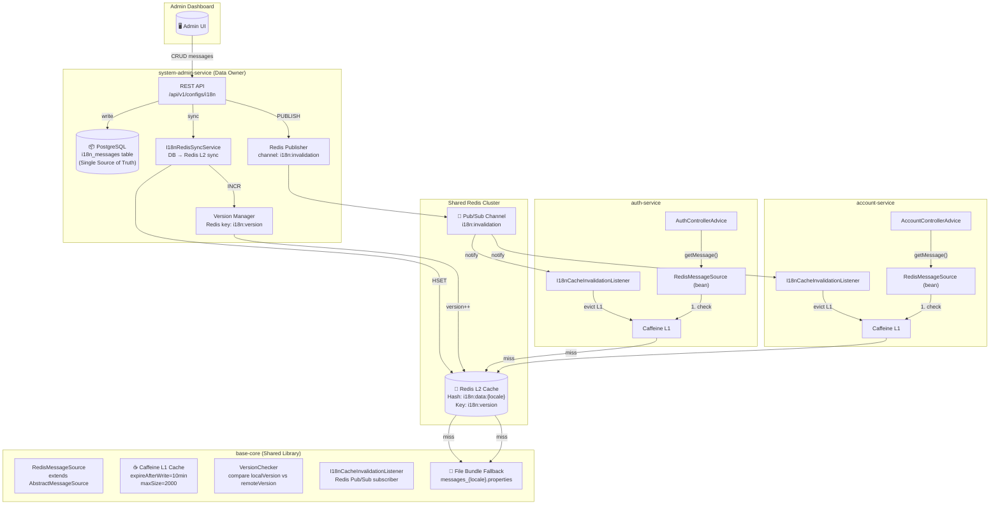
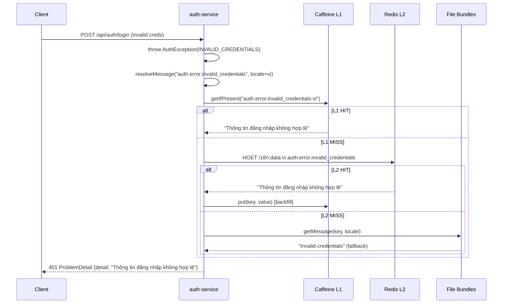
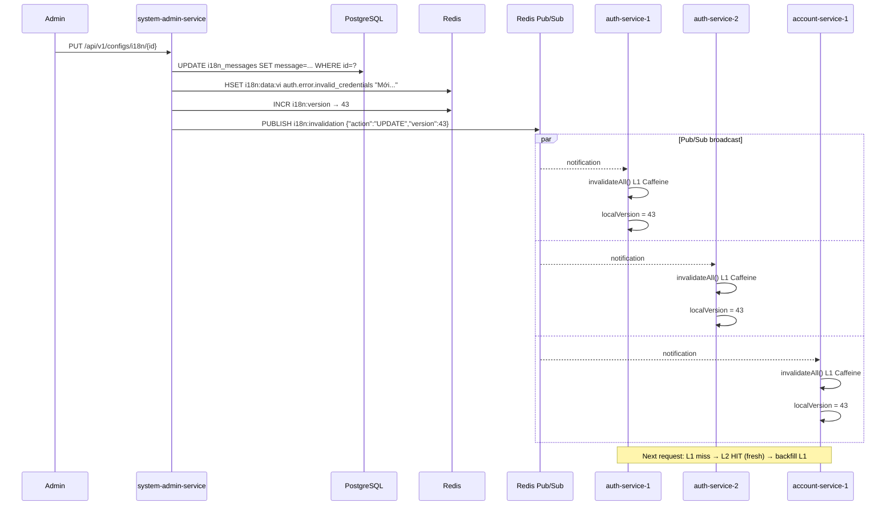

# Technical Specification — Centralized i18n Messages Management

## 1. Architecture Overview



## 2. Architecture Decision Records (ADR)

### ADR-001: Database Ownership — system-admin-service là Single Owner

**Context:** `i18n_messages` table đang duplicate ở 2 services.

**Decision:** Chỉ giữ `i18n_messages` ở `system-admin-service` database. Xóa entity/repository/migration khỏi auth-service.

**Rationale:**
- system-admin-service đã có `VersionedConfigDomain<I18nMessageEntity>` → CRUD, versioning, snapshot, rollback
- system-admin-service là service quản trị hệ thống → phù hợp sở hữu config data
- auth-service không nên own config data — nó là consumer
- Tuân theo **Data Ownership principle** trong microservices

**Consequences:**
- auth-service phải xóa: `I18nMessageEntity`, `I18nMessageRepository`, `DatabaseMessageSource`, migration files
- Các consumer services dùng Redis-backed MessageSource từ base-core thay vì DB-backed

### ADR-002: Consumer Services dùng Redis-Only (KHÔNG query DB trực tiếp)

**Context:** Nếu consumer services gọi API hoặc share database → coupling runtime.

**Decision:** Consumer services chỉ đọc i18n messages từ Redis L2 cache (+ L1 Caffeine local). KHÔNG gọi API hay share DB connection.

**Rationale:**
- **Performance:** Redis read < 1ms vs API call ~10-50ms vs DB query ~5-20ms
- **Decoupling:** Consumer service không phụ thuộc runtime vào system-admin-service
- **Resilience:** Nếu system-admin-service down, consumer vẫn hoạt động bình thường (data đã trong Redis + L1)
- **SOLID — DIP:** Consumer phụ thuộc vào abstraction (`MessageSource`) không phải implementation cụ thể

**Trade-offs:**
- **Eventual consistency:** Cache có thể stale tối đa 1-2 giây (Pub/Sub propagation time)
- **Redis dependency:** Nếu Redis down, fallback to file bundles (graceful degradation)
- **Data freshness:** Giải quyết bằng Version-based ETag pattern

### ADR-003: 2-Level Cache — Caffeine L1 + Redis L2

**Context:** Cần performance tối ưu cho message resolution (được gọi mọi request).

**Decision:** Implement 2-level cache architecture:
- **L1 (Caffeine):** In-process, sub-nanosecond access, per-instance
- **L2 (Redis):** Distributed, sub-millisecond access, shared across all instances

**Implementation:**

```
Resolution Chain:
┌──────────┐    miss    ┌──────────┐    miss    ┌──────────────────┐
│ Caffeine │ ────────→ │  Redis   │ ────────→ │ File Bundles     │
│ L1 Cache │ ←──────── │ L2 Cache │           │ (fallback only)  │
│ ~0.01ms  │  backfill │ ~0.5ms   │           │ classpath:msgs/  │
└──────────┘           └──────────┘           └──────────────────┘
```

**Rationale:**
- L1 handles 95%+ requests (hot path) → near-zero latency
- L2 ensures consistency across instances + survives instance restart
- File bundles = safety net → system NEVER returns raw error code to user

### ADR-004: Cache Invalidation — Redis Pub/Sub + Version ETag

**Context:** Khi admin update message, tất cả instances cần biết lập tức.

**Decision:** Combine 2 mechanisms:
1. **Redis Pub/Sub** broadcast invalidation event → evict L1 cache
2. **Version counter** (`i18n:version` key) → bulk validation

**Flow:**
```
Admin updates message
    ↓
system-admin-service:
    1. UPDATE DB
    2. HSET redis i18n:data:{locale} {code} {message}  ← update L2
    3. INCR redis i18n:version                          ← bump version
    4. PUBLISH redis i18n:invalidation {action, locale, code, newVersion}
    ↓
All consumer instances (via Pub/Sub):
    5. Receive notification
    6. Compare localVersion vs newVersion
    7. If mismatch → invalidate ENTIRE L1 Caffeine cache
    8. Update localVersion = newVersion
    ↓
Next request (any consumer):
    9. L1 MISS → L2 HIT (fresh data from step 2) → backfill L1
```

**Tại sao invalidate toàn bộ L1 thay vì chỉ 1 key?**
- Admin thường batch update nhiều messages cùng lúc
- Caffeine evict by key = N Pub/Sub messages → overhead
- Full invalidation L1 = 1 Pub/Sub message + L2 backfill on next access
- L2 (Redis) luôn có data mới → backfill nhanh (batch HGETALL ~1ms)

**Tại sao KHÔNG dùng Caffeine TTL-only?**
- TTL 5 phút = stale window 0-5 phút → admin thay đổi, user đợi max 5 phút
- Pub/Sub = near real-time < 1 giây
- Version check = double protection nếu Pub/Sub message bị miss

### ADR-005: Redis Data Structure — Hash per Locale

**Decision:** Dùng Redis Hash để lưu messages theo locale:
```
Key: i18n:data:en  → Hash { "auth.error.invalid_credentials": "Invalid...", ... }
Key: i18n:data:vi  → Hash { "auth.error.invalid_credentials": "Thông tin...", ... }
Key: i18n:version  → String "42"
```

**Rationale:**
- `HGET i18n:data:en auth.error.invalid_credentials` → O(1) single key lookup
- `HGETALL i18n:data:en` → bulk preload all messages for a locale (~1ms for 500 entries)
- Memory efficient: Redis Hash < many separate String keys
- Key namespace clean: 2-3 keys total vs 1000+ individual keys

## 3. Component Design

### 3.1 base-core — Shared Library Components (MỚI)

```kotlin
// ===== 1. RedisMessageSource (thay thế DatabaseMessageSource) =====
// Package: com.ntt.basecore.autoconfigure.i18n

class RedisMessageSource(
    private val redisTemplate: StringRedisTemplate,
    private val fallbackMessageSource: MessageSource?  // file bundles
) : AbstractMessageSource() {

    private val l1Cache: Cache<String, String> = Caffeine.newBuilder()
        .maximumSize(2000)
        .expireAfterWrite(10, TimeUnit.MINUTES)  // safety TTL
        .build()

    @Volatile
    private var localVersion: Long = -1

    override fun resolveCode(code: String, locale: Locale): MessageFormat? {
        val cacheKey = "${code}:${locale.language}"

        // L1: Caffeine
        l1Cache.getIfPresent(cacheKey)?.let {
            return createMessageFormat(it, locale)
        }

        // L2: Redis Hash
        try {
            val message = redisTemplate.opsForHash<String, String>()
                .get("i18n:data:${locale.language}", code)
            if (message != null) {
                l1Cache.put(cacheKey, message)
                return createMessageFormat(message, locale)
            }
        } catch (e: Exception) {
            log.warn("Redis L2 lookup failed: code={}, locale={}", code, locale, e)
        }

        // Fallback: parent (file bundles)
        return null  // AbstractMessageSource delegates to parent
    }

    fun invalidateAll() {
        l1Cache.invalidateAll()
        log.info("L1 cache fully invalidated")
    }

    fun updateLocalVersion(newVersion: Long) {
        this.localVersion = newVersion
    }
}

// ===== 2. I18nCacheInvalidationListener (Redis Pub/Sub) =====
// Listens on channel "i18n:invalidation", evicts L1 cache

class I18nCacheInvalidationListener(
    private val redisMessageSource: RedisMessageSource
) : MessageListener {

    override fun onMessage(message: Message, pattern: ByteArray?) {
        val body = String(message.body)
        // Parse version from message, compare, invalidate
        redisMessageSource.invalidateAll()
        log.info("I18n cache invalidated via Pub/Sub: {}", body)
    }
}

// ===== 3. I18nCacheAutoConfiguration (Spring Auto-config) =====
// @ConditionalOnBean(RedisConnectionFactory::class)
// @ConditionalOnProperty("app.i18n.redis.enabled", havingValue = "true", matchIfMissing = true)

@Configuration
@ConditionalOnBean(RedisConnectionFactory::class)
class I18nCacheAutoConfiguration {

    @Bean
    @ConditionalOnMissingBean(name = ["redisMessageSource"])
    fun redisMessageSource(
        redisTemplate: StringRedisTemplate,
        @Qualifier("fileBundleMessageSource") fileFallback: MessageSource?
    ): RedisMessageSource {
        val source = RedisMessageSource(redisTemplate, fileFallback)
        fileFallback?.let { source.setParentMessageSource(it) }
        return source
    }

    @Bean
    fun i18nCacheListenerContainer(
        connectionFactory: RedisConnectionFactory,
        redisMessageSource: RedisMessageSource
    ): RedisMessageListenerContainer {
        val container = RedisMessageListenerContainer()
        container.setConnectionFactory(connectionFactory)
        val listener = MessageListenerAdapter(
            I18nCacheInvalidationListener(redisMessageSource), "onMessage"
        )
        container.addMessageListener(listener, ChannelTopic("i18n:invalidation"))
        return container
    }
}
```

### 3.2 system-admin-service — Data Owner Components (MODIFY)

```kotlin
// ===== I18nRedisSyncService (MỚI) =====
// Syncs i18n_messages from DB → Redis L2 + publishes invalidation

@Service
class I18nRedisSyncService(
    private val repository: I18nMessageRepository,
    private val redisTemplate: StringRedisTemplate
) {
    companion object {
        const val CHANNEL = "i18n:invalidation"
        const val VERSION_KEY = "i18n:version"
        fun dataKey(locale: String) = "i18n:data:$locale"
    }

    /**
     * Full sync: Load all active messages from DB → Redis Hashes
     * Called on: startup, manual refresh, after batch import
     */
    @Transactional(readOnly = true)
    fun fullSync() {
        val allMessages = repository.findAllByIsActiveTrue()
        val byLocale = allMessages.groupBy { it.locale }

        for ((locale, messages) in byLocale) {
            val hashKey = dataKey(locale)
            // Clear old hash
            redisTemplate.delete(hashKey)
            // Bulk set
            val entries = messages.associate { it.code to it.message }
            redisTemplate.opsForHash<String, String>().putAll(hashKey, entries)
        }

        // Increment version
        val newVersion = redisTemplate.opsForValue().increment(VERSION_KEY) ?: 1
        // Publish invalidation
        publishInvalidation("FULL_SYNC", newVersion)

        log.info("I18n full sync completed: {} messages, version={}", allMessages.size, newVersion)
    }

    /**
     * Incremental sync: Update specific message in Redis + publish
     */
    fun syncSingleMessage(code: String, locale: String, message: String) {
        redisTemplate.opsForHash<String, String>()
            .put(dataKey(locale), code, message)
        val newVersion = redisTemplate.opsForValue().increment(VERSION_KEY) ?: 1
        publishInvalidation("UPDATE:$locale:$code", newVersion)
    }

    /**
     * Delete message from Redis + publish
     */
    fun deleteSingleMessage(code: String, locale: String) {
        redisTemplate.opsForHash<String, String>()
            .delete(dataKey(locale), code)
        val newVersion = redisTemplate.opsForValue().increment(VERSION_KEY) ?: 1
        publishInvalidation("DELETE:$locale:$code", newVersion)
    }

    private fun publishInvalidation(action: String, version: Long) {
        val payload = """{"action":"$action","version":$version,"timestamp":${System.currentTimeMillis()}}"""
        redisTemplate.convertAndSend(CHANNEL, payload)
    }
}
```

### 3.3 auth-service — Consumer Changes (REMOVE + RECONFIGURE)

**Xóa:**
- `I18nMessageEntity.kt`
- `I18nMessageRepository.kt`
- `DatabaseMessageSource.kt`
- `V5__create_i18n_messages.sql` (cần migration xóa table)
- `V6__seed_i18n_messages.sql`

**Modify `I18nConfig.kt`:**
```kotlin
@Configuration
class I18nConfig {

    @Bean
    fun localeResolver(): LocaleResolver {
        val resolver = AcceptHeaderLocaleResolver()
        resolver.supportedLocales = listOf(Locale.ENGLISH, Locale.forLanguageTag("vi"))
        resolver.setDefaultLocale(Locale.ENGLISH)
        return resolver
    }

    // RedisMessageSource auto-configured by base-core's I18nCacheAutoConfiguration
    // File bundles configured as fallback parent

    @Bean("fileBundleMessageSource")
    fun fileBundleMessageSource(): MessageSource {
        val source = ReloadableResourceBundleMessageSource()
        source.setBasenames(
            "classpath:messages/auth-messages",
            "classpath:messages/messages"
        )
        source.setDefaultEncoding("UTF-8")
        source.setFallbackToSystemLocale(false)
        return source
    }
}
```

## 4. Data Flow Diagrams

### 4.1 Message Resolution Sequence



### 4.2 Admin Update + Cache Invalidation Sequence



## 5. Redis Key Schema

| Key | Type | TTL | Content |
|-----|------|-----|---------|
| `i18n:data:en` | Hash | No TTL (managed) | `{code1: msg1, code2: msg2, ...}` |
| `i18n:data:vi` | Hash | No TTL (managed) | `{code1: msg1, code2: msg2, ...}` |
| `i18n:version` | String | No TTL | Monotonic counter, e.g., `"43"` |

**Pub/Sub Channel:** `i18n:invalidation`

**Message Format:**
```json
{
  "action": "UPDATE:vi:auth.error.invalid_credentials",
  "version": 43,
  "timestamp": 1727753000000
}
```

## 6. Performance Analysis

| Scenario | Current (auth-service) | Proposed |
|----------|----------------------|----------|
| **Hot path (L1 hit)** | ~0.01ms (Caffeine) | ~0.01ms (Caffeine) ← same |
| **L1 miss** | ~5-20ms (DB query) | ~0.5ms (Redis HGET) ← 10-40x faster |
| **Cache invalidation latency** | 0-5 min (TTL expiry) | < 1 sec (Pub/Sub) ← real-time |
| **Startup time** | Cold → DB query per key | Warm → Redis HGETALL bulk |
| **Memory per instance** | Caffeine 500 entries | Caffeine 2000 entries (messages nhẹ, ~200 bytes/entry) |
| **Redis memory** | N/A | ~1 MB per locale (5000 messages × 200 bytes) |
| **Cross-service consistency** | ❌ Independent DBs | ✅ Single Redis source |

## 7. Comparison: Architecture Alternatives

### Option A: API Gateway Pattern (REJECTED)

```
Consumer → HTTP call → system-admin-service API → DB
```
- ❌ Runtime coupling: consumer depends on system-admin-service availability
- ❌ Latency: 10-50ms per API call vs 0.01ms cache hit
- ❌ Throughput: system-admin-service becomes bottleneck
- ❌ Violates microservice independence

### Option B: Shared Database (REJECTED)

```
Consumer → JPA query → system-admin-service DB (shared connection)
```
- ❌ Database coupling: multiple services share one DB
- ❌ Connection pool contention
- ❌ Schema migration coordination nightmare
- ❌ Anti-pattern in microservices

### Option C: Event-Driven Full Replication (REJECTED)

```
system-admin-service → Kafka event → consumer receives → writes to own DB
```
- ⚠️ Over-engineering: each service maintains full i18n_messages copy
- ⚠️ Storage waste: same data replicated N times
- ⚠️ Complex: Kafka infrastructure, consumer offset management
- ✅ Full independence

### Option D: Redis as Shared Read Cache (CHOSEN) ✅

```
system-admin-service → writes DB + Redis L2
Consumer → reads Redis L2 (via base-core RedisMessageSource)
```
- ✅ Performance: sub-millisecond reads
- ✅ Single Source of Truth: DB owned by system-admin-service
- ✅ Decoupled: consumers don't know/care about system-admin-service
- ✅ Resilient: file bundle fallback if Redis down
- ✅ Simple: no new infrastructure (Redis already exists)
- ⚠️ Trade-off: eventual consistency (< 1 sec via Pub/Sub)

## 8. Migration Plan

### Phase 1: base-core Enhancement
1. Create `RedisMessageSource` in base-core
2. Create `I18nCacheInvalidationListener` in base-core
3. Create `I18nCacheAutoConfiguration` (auto-config with `@ConditionalOnBean`)
4. Unit tests

### Phase 2: system-admin-service — Sync Service
1. Create `I18nRedisSyncService` (DB → Redis sync + Pub/Sub publish)
2. Add `@EventListener(ApplicationReadyEvent)` for startup full sync
3. Modify `I18nMessageVersionedDomain.applyRollbackState()` to call sync service
4. Add REST endpoint for manual refresh trigger
5. Integration tests

### Phase 3: auth-service — Migration
1. Remove `I18nMessageEntity`, `I18nMessageRepository`, `DatabaseMessageSource`
2. Add Flyway migration to DROP `i18n_messages` table from auth-service DB
3. Update `I18nConfig` to use `RedisMessageSource` from base-core auto-config
4. Keep file bundles as fallback parent
5. Verify all tests pass

### Phase 4: account-service + other services
1. Each service auto-gets `RedisMessageSource` via base-core auto-config
2. Just add file bundles for service-specific fallback messages
3. No additional code needed

## 9. Agent Implementation Notes

### Kiểm tra trước khi implement:
- [ ] Confirm Redis cluster đang chạy và shared giữa tất cả services
- [ ] Confirm base-core dependency version consistent across services
- [ ] Backup auth-service i18n_messages data trước khi DROP table
- [ ] Verify seed data (V6__seed_i18n_messages.sql) đã tồn tại trong system-admin-service DB

### Risk mitigation:
- **Data migration:** Export auth-service `i18n_messages` → import vào system-admin-service trước khi xóa
- **Rollback plan:** Nếu Redis down lâu dài, tất cả services vẫn chạy ok với file bundles
- **Monitoring:** Add metrics: L1 hit ratio, L2 hit ratio, Pub/Sub latency
