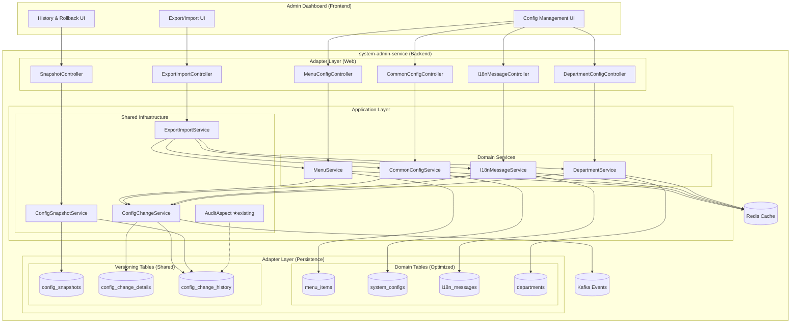
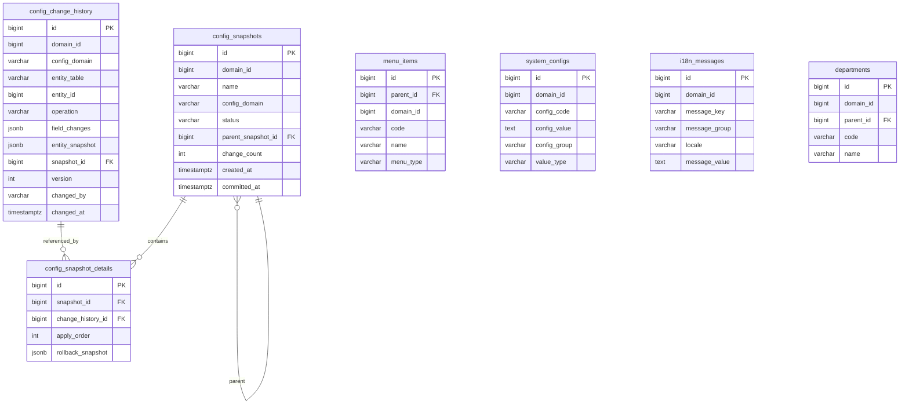
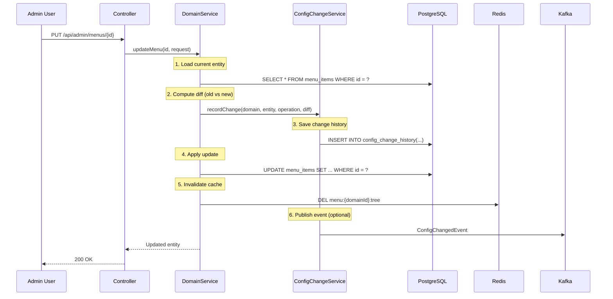
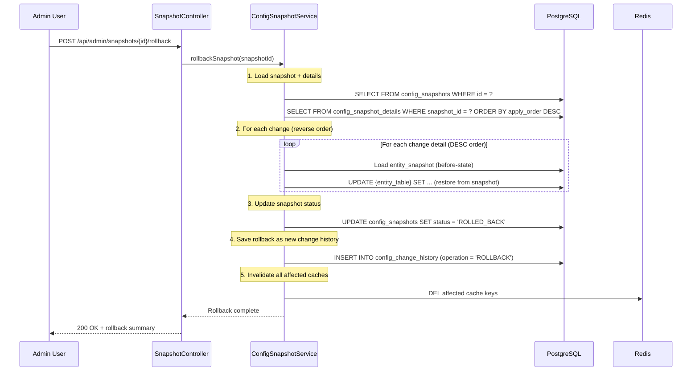
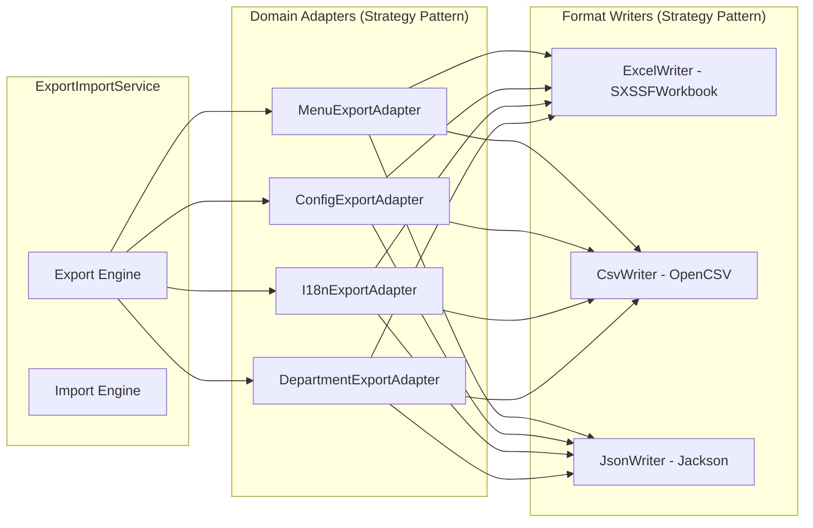
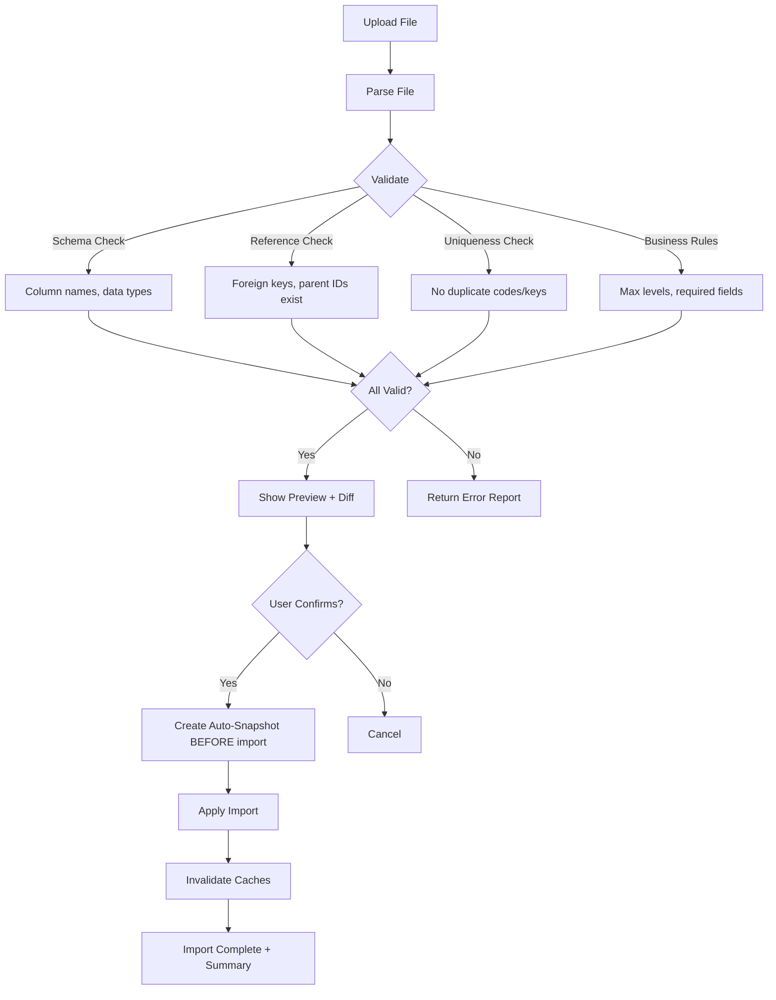

# Technical Specification: Configuration Management System
# Export/Import, Audit Trail, Snapshot/Rollback

**Version:** 1.0
**Date:** 2026-09-30
**Service:** system-admin-service

---

## 1. Tổng quan kiến trúc

### 1.1 Triết lý thiết kế

> **"Config domains live on their own optimized tables; versioning/audit/export share a unified infrastructure."**

Nguyên tắc:
- **Separated Domain Tables**: Mỗi domain (Menu, Config, i18n, Department) giữ bảng riêng biệt, tối ưu cho read performance
- **Shared Versioning Infrastructure**: Cơ chế snapshot/changeset/rollback dùng chung 1 bộ bảng centralized
- **Decoupled Export Engine**: Export/Import engine generic, pluggable cho bất kỳ config domain nào
- **Reuse existing patterns**: Extend `AuditAspect`, `SnowflakePersistentAuditableEntity`, Redis caching pattern

### 1.2 Architecture Overview



---

## 2. Database Schema Design

### 2.1 Nguyên tắc thiết kế

1. **Domain tables giữ nguyên** — không thêm versioning columns vào bảng chính → giữ read performance
2. **Centralized change tracking** — 1 bộ bảng cho tất cả config domains
3. **Snapshot = named collection of changes** — giống Flyway changeset nhưng cho runtime config
4. **Immutable history** — change records KHÔNG bao giờ bị xóa/sửa

### 2.2 Bảng mới: Versioning Infrastructure

#### 2.2.1 `config_change_history` — Ghi lại MỌI thay đổi trên mọi config domain

```sql
-- Bảng ghi lại từng thay đổi riêng lẻ trên bất kỳ config domain nào
CREATE TABLE config_change_history (
    id                  BIGINT PRIMARY KEY,            -- Snowflake ID
    domain_id           BIGINT       NOT NULL,         -- Tenant isolation
    config_domain       VARCHAR(50)  NOT NULL,         -- 'MENU', 'SYSTEM_CONFIG', 'I18N_MESSAGE', 'DEPARTMENT', 'FEATURE_FLAG'
    entity_table        VARCHAR(100) NOT NULL,         -- Tên bảng gốc: 'menu_items', 'system_configs', ...
    entity_id           BIGINT       NOT NULL,         -- PK của record bị thay đổi
    operation           VARCHAR(10)  NOT NULL,         -- 'INSERT', 'UPDATE', 'DELETE'
    field_changes       JSONB,                         -- {"fieldName": {"old": X, "new": Y}, ...}
    entity_snapshot     JSONB        NOT NULL,         -- Full snapshot of entity TRƯỚC khi thay đổi
    snapshot_id         BIGINT,                        -- FK → config_snapshots.id (NULL nếu chưa gán vào snapshot)
    version             INT          NOT NULL DEFAULT 1,
    changed_by          VARCHAR(100),
    changed_at          TIMESTAMPTZ  NOT NULL DEFAULT NOW(),
    change_reason       TEXT,
    ip_address          VARCHAR(50),
    user_agent          VARCHAR(500)
);

-- Indexes cho tra cứu nhanh
CREATE INDEX idx_cch_domain_config ON config_change_history(domain_id, config_domain);
CREATE INDEX idx_cch_entity ON config_change_history(entity_table, entity_id);
CREATE INDEX idx_cch_changed_at ON config_change_history(changed_at DESC);
CREATE INDEX idx_cch_snapshot ON config_change_history(snapshot_id);
CREATE INDEX idx_cch_version ON config_change_history(config_domain, entity_id, version DESC);

COMMENT ON TABLE config_change_history IS 'Universal change tracking for all config domains';
COMMENT ON COLUMN config_change_history.field_changes IS 'JSON diff: {"fieldName": {"old": "v1", "new": "v2"}}';
COMMENT ON COLUMN config_change_history.entity_snapshot IS 'Full entity state BEFORE change (for rollback)';
```

#### 2.2.2 `config_snapshots` — Mốc thay đổi (named milestone/changeset)

```sql
-- Nhóm nhiều thay đổi thành 1 mốc có tên
CREATE TABLE config_snapshots (
    id                  BIGINT PRIMARY KEY,            -- Snowflake ID
    domain_id           BIGINT       NOT NULL,
    name                VARCHAR(200) NOT NULL,         -- Tên mốc: "Release 2.1 Config", "Pre-migration backup"
    description         TEXT,
    config_domain       VARCHAR(50),                   -- NULL = cross-domain, hoặc specific domain
    status              VARCHAR(20)  NOT NULL DEFAULT 'DRAFT',  -- DRAFT, COMMITTED, APPLIED, ROLLED_BACK
    parent_snapshot_id  BIGINT REFERENCES config_snapshots(id), -- Snapshot trước đó (linked list)
    change_count        INT          NOT NULL DEFAULT 0,
    created_by          VARCHAR(100),
    created_at          TIMESTAMPTZ  NOT NULL DEFAULT NOW(),
    committed_at        TIMESTAMPTZ,
    applied_at          TIMESTAMPTZ,
    rolled_back_at      TIMESTAMPTZ,
    metadata_json       JSONB                          -- Extra metadata: tags, environment, etc.
);

CREATE INDEX idx_cs_domain ON config_snapshots(domain_id);
CREATE INDEX idx_cs_status ON config_snapshots(status);
CREATE INDEX idx_cs_domain_config ON config_snapshots(domain_id, config_domain);
CREATE UNIQUE INDEX idx_cs_domain_name ON config_snapshots(domain_id, name);

COMMENT ON TABLE config_snapshots IS 'Named milestones grouping multiple config changes';
COMMENT ON COLUMN config_snapshots.status IS 'DRAFT=collecting changes, COMMITTED=finalized, APPLIED=active, ROLLED_BACK=reverted';
```

#### 2.2.3 `config_snapshot_details` — Chi tiết mỗi snapshot chứa những changes nào

```sql
-- Mapping N:M giữa snapshot và individual changes
CREATE TABLE config_snapshot_details (
    id                  BIGINT PRIMARY KEY,
    snapshot_id         BIGINT       NOT NULL REFERENCES config_snapshots(id),
    change_history_id   BIGINT       NOT NULL REFERENCES config_change_history(id),
    apply_order         INT          NOT NULL DEFAULT 0,  -- Thứ tự apply trong snapshot
    rollback_snapshot   JSONB,                            -- Entity state để rollback (before snapshot was applied)

    UNIQUE(snapshot_id, change_history_id)
);

CREATE INDEX idx_csd_snapshot ON config_snapshot_details(snapshot_id, apply_order);
CREATE INDEX idx_csd_change ON config_snapshot_details(change_history_id);

COMMENT ON TABLE config_snapshot_details IS 'Links config changes to named snapshots with ordering';
```

### 2.3 Bảng mới: i18n Messages

```sql
-- Bảng quản lý message đa ngôn ngữ từ database
CREATE TABLE i18n_messages (
    id              BIGINT PRIMARY KEY,           -- Snowflake ID
    domain_id       BIGINT       NOT NULL,
    message_key     VARCHAR(255) NOT NULL,         -- e.g., 'error.auth.invalid', 'label.user.name'
    message_group   VARCHAR(100) NOT NULL DEFAULT 'DEFAULT', -- Nhóm: 'ERROR', 'LABEL', 'NOTIFICATION', 'VALIDATION'
    locale          VARCHAR(10)  NOT NULL,         -- 'vi', 'en', 'ko', 'ja'
    message_value   TEXT         NOT NULL,         -- Nội dung message
    description     TEXT,                          -- Mô tả cho admin
    is_active       BOOLEAN      NOT NULL DEFAULT TRUE,
    created_at      BIGINT       NOT NULL,
    created_by      VARCHAR(100),
    updated_at      BIGINT,
    updated_by      VARCHAR(100),

    UNIQUE(domain_id, message_key, locale)
);

CREATE INDEX idx_i18n_domain_key ON i18n_messages(domain_id, message_key);
CREATE INDEX idx_i18n_domain_group ON i18n_messages(domain_id, message_group);
CREATE INDEX idx_i18n_domain_locale ON i18n_messages(domain_id, locale);

COMMENT ON TABLE i18n_messages IS 'Dynamic i18n messages managed from database (multi-tenant)';
COMMENT ON COLUMN i18n_messages.message_key IS 'Hierarchical key: section.subsection.field';
COMMENT ON COLUMN i18n_messages.message_group IS 'Logical grouping: ERROR, LABEL, NOTIFICATION, VALIDATION, MENU';
```

### 2.4 Bảng mới: System Configs (Common Config)

```sql
-- Bảng cấu hình chung (key-value với grouping)
CREATE TABLE system_configs (
    id              BIGINT PRIMARY KEY,
    domain_id       BIGINT       NOT NULL,
    config_code     VARCHAR(100) NOT NULL,         -- Unique code per domain
    config_value    TEXT         NOT NULL,
    config_group    VARCHAR(100) NOT NULL DEFAULT 'GENERAL',  -- Nhóm: GENERAL, SECURITY, EMAIL, SMS, PAYMENT...
    value_type      VARCHAR(20)  NOT NULL DEFAULT 'STRING',   -- STRING, NUMBER, BOOLEAN, JSON
    description     TEXT,
    is_encrypted    BOOLEAN      NOT NULL DEFAULT FALSE,       -- Giá trị có mã hóa không
    is_active       BOOLEAN      NOT NULL DEFAULT TRUE,
    sort_order      INT          NOT NULL DEFAULT 0,
    created_at      BIGINT       NOT NULL,
    created_by      VARCHAR(100),
    updated_at      BIGINT,
    updated_by      VARCHAR(100),

    UNIQUE(domain_id, config_code)
);

CREATE INDEX idx_sc_domain_group ON system_configs(domain_id, config_group);
CREATE INDEX idx_sc_domain_code ON system_configs(domain_id, config_code);

COMMENT ON TABLE system_configs IS 'Key-value system configuration with grouping (multi-tenant)';
```

### 2.5 Entity Relationship Diagram



---

## 3. Core Mechanisms

### 3.1 Change Tracking Flow



### 3.2 Snapshot Lifecycle

```
                     ┌─────────────────────────────────────────────┐
                     │           SNAPSHOT LIFECYCLE                 │
                     ├─────────────────────────────────────────────┤
                     │                                             │
   CREATE ──────►    │  DRAFT                                      │
                     │  ├── Changes tích lũy tự động               │
                     │  ├── Hoặc gán thủ công change vào snapshot  │
                     │  └── Có thể thêm/xóa changes               │
                     │                                             │
   COMMIT ──────►    │  COMMITTED                                  │
                     │  ├── Freeze snapshot (no more changes)      │
                     │  ├── Lưu lại entity_snapshot cho rollback   │
                     │  └── Snapshot trở thành immutable           │
                     │                                             │
   APPLY ───────►    │  APPLIED                                    │
                     │  ├── Tất cả changes trong snapshot active   │
                     │  ├── Đây là trạng thái "live"              │
                     │  └── Invalidate all related caches          │
                     │                                             │
   ROLLBACK ────►    │  ROLLED_BACK                                │
                     │  ├── Revert tất cả changes về trước snapshot│
                     │  ├── Restore entity states từ entity_snapshot│
                     │  └── Invalidate all related caches          │
                     │                                             │
                     └─────────────────────────────────────────────┘
```

### 3.3 Rollback Flow



---

## 4. Export/Import Engine

### 4.1 Supported Formats

| Format | Library | Use Case |
|--------|---------|----------|
| **Excel (.xlsx)** | Apache POI `SXSSFWorkbook` (streaming) | Human-readable, multi-sheet, formatted |
| **CSV** | OpenCSV | Lightweight, git-diffable |
| **JSON** | Jackson ObjectMapper | Machine-readable, API-friendly, full fidelity |

### 4.2 Export Architecture



### 4.3 Export Format: Multi-sheet Excel

```
📊 config_export_2026-09-30.xlsx
├── Sheet 1: "Menu Items"
│   ├── Headers: ID | Parent ID | Code | Name | Icon | Path | Type | Sort | Level | Status
│   └── Data rows...
├── Sheet 2: "Menu Permissions"
│   ├── Headers: Menu Code | Permission Code | Name | Description
│   └── Data rows...
├── Sheet 3: "System Configs"
│   ├── Headers: Code | Value | Group | Type | Description | Encrypted
│   └── Data rows...
├── Sheet 4: "i18n Messages"
│   ├── Headers: Key | Group | vi | en | ko | ja | Description
│   └── Data rows (pivot by locale)
├── Sheet 5: "Departments"
│   ├── Headers: Code | Name | Parent Code | Manager | Status | Sort
│   └── Data rows...
└── Sheet 6: "Metadata"
    ├── Export Date, Domain ID, Version
    ├── Record counts per sheet
    └── Checksum
```

### 4.4 Import Validation Flow



---

## 5. API Endpoints

### 5.1 Config Change History

```
GET    /api/admin/config-history?domain={configDomain}&entityId={id}&limit=5
       → Lấy N lần thay đổi gần nhất của 1 entity

GET    /api/admin/config-history/recent?domain={configDomain}&limit=20
       → Lấy 20 thay đổi gần nhất trên 1 config domain

GET    /api/admin/config-history/{changeId}
       → Chi tiết 1 thay đổi (bao gồm diff)

GET    /api/admin/config-history/{changeId}/diff
       → Field-level diff (old vs new) cho 1 thay đổi
```

### 5.2 Snapshots

```
POST   /api/admin/snapshots
       Body: { name, description, configDomain? }
       → Tạo snapshot mới (status = DRAFT)

GET    /api/admin/snapshots?domain={configDomain}&status={status}
       → Danh sách snapshots

GET    /api/admin/snapshots/{id}
       → Chi tiết snapshot + danh sách changes

POST   /api/admin/snapshots/{id}/commit
       → Commit snapshot (freeze, no more changes)

POST   /api/admin/snapshots/{id}/apply
       → Apply snapshot (make changes live)

POST   /api/admin/snapshots/{id}/rollback
       → Rollback snapshot (revert all changes)

POST   /api/admin/snapshots/{id}/changes
       Body: { changeHistoryIds: [1, 2, 3] }
       → Gán changes vào snapshot

DELETE /api/admin/snapshots/{id}/changes/{changeId}
       → Xóa change khỏi snapshot (only DRAFT)

GET    /api/admin/snapshots/{id}/compare/{otherId}
       → So sánh 2 snapshots
```

### 5.3 Export/Import

```
GET    /api/admin/export?domain={configDomain}&format={xlsx|csv|json}
       → Export config data

GET    /api/admin/export/all?format={xlsx|csv|json}
       → Export ALL config domains (multi-sheet Excel)

POST   /api/admin/import/validate
       Body: multipart file
       → Validate file + return preview + diff

POST   /api/admin/import/apply
       Body: multipart file + { createSnapshot: true, snapshotName: "..." }
       → Apply import (auto-snapshot trước khi import)
```

### 5.4 i18n Messages

```
GET    /api/admin/i18n/messages?group={group}&locale={locale}&page=0&size=50
POST   /api/admin/i18n/messages
PUT    /api/admin/i18n/messages/{id}
DELETE /api/admin/i18n/messages/{id}

GET    /api/public/i18n/{locale}?group={group}
       → Public endpoint cho frontend load messages (cached in Redis)
```

### 5.5 System Configs

```
GET    /api/admin/system-configs?group={group}&page=0&size=50
POST   /api/admin/system-configs
PUT    /api/admin/system-configs/{id}
DELETE /api/admin/system-configs/{id}

GET    /api/public/system-configs/{configCode}
       → Public endpoint cho services lấy config value (cached in Redis)
```

---

## 6. Domain Adapters (Strategy Pattern)

### 6.1 Interface

```kotlin
/**
 * Generic adapter for config domain export/import and change tracking.
 * Each config domain implements this to plug into the shared infrastructure.
 */
interface ConfigDomainAdapter<E> {
    /** Unique domain identifier: MENU, SYSTEM_CONFIG, I18N_MESSAGE, DEPARTMENT */
    val configDomain: String

    /** Target table name */
    val entityTable: String

    /** Export all entities for a domain */
    fun exportAll(domainId: Long): List<E>

    /** Export entity to flat map (for Excel/CSV) */
    fun toExportRow(entity: E): Map<String, Any?>

    /** Import from flat map */
    fun fromImportRow(row: Map<String, Any?>, domainId: Long): E

    /** Get entity headers for export */
    fun getExportHeaders(): List<String>

    /** Get entity by ID */
    fun findById(id: Long): E?

    /** Serialize entity to JSONB snapshot */
    fun toSnapshot(entity: E): String

    /** Deserialize entity from JSONB snapshot */
    fun fromSnapshot(snapshot: String): E

    /** Compute field-level diff between old and new */
    fun computeDiff(old: E, new: E): Map<String, FieldChange>

    /** Apply entity state (for rollback) */
    fun applyState(entity: E): E
}

data class FieldChange(
    val old: Any?,
    val new: Any?
)
```

### 6.2 Registration

```kotlin
@Configuration
class ConfigDomainAdapterConfig {

    @Bean
    fun configDomainAdapters(adapters: List<ConfigDomainAdapter<*>>): Map<String, ConfigDomainAdapter<*>> {
        return adapters.associateBy { it.configDomain }
    }
}
```

---

## 7. Caching Strategy

### 7.1 Cache Keys

| Domain | Cache Key Pattern | TTL |
|--------|-------------------|-----|
| Menu Tree | `menu:{domainId}:tree` | 30 min |
| System Config | `config:{domainId}:{configCode}` | 60 min |
| i18n Messages | `i18n:{domainId}:{locale}:{group}` | 60 min |
| i18n All | `i18n:{domainId}:{locale}:all` | 60 min |
| Department Tree | `dept:{domainId}:tree` | 30 min |

### 7.2 Cache Invalidation

- **On individual change**: Invalidate specific key
- **On snapshot apply/rollback**: Invalidate ALL keys for affected domain
- **On import**: Invalidate ALL keys for imported domain
- **Pattern**: Dùng `SCAN` + `DEL` cho wildcard invalidation (NOT `KEYS *`)

---

## 8. Performance Considerations

### 8.1 Read Path (Hot Path)

- Domain tables giữ nguyên, không JOIN với history tables
- Redis cache trước DB query
- i18n messages: load ALL messages cho 1 locale vào Redis (1 key = 1 locale bundle)
- Menu tree: cache full tree JSON cho 1 domain

### 8.2 Write Path

- Change history INSERT is append-only → high throughput
- Snapshot operations are batch → wrap in `@Transactional`
- Export: dùng `SXSSFWorkbook` streaming → không OOM với dataset lớn
- Import: batch INSERT (chunk 500 records) → giảm round-trips

### 8.3 Storage

- `config_change_history` sẽ grow lớn → cần PARTITION by `changed_at` (monthly)
- Retention policy: giữ 6 tháng online, archive older to cold storage
- `entity_snapshot` JSONB: nén tự động bởi PostgreSQL TOAST

---

## 9. Agent Implementation Notes

### 9.1 Implementation Order (phân task cho downstream pipeline)

| Phase | Task | Dependencies | Estimate |
|-------|------|-------------|----------|
| 1 | Flyway migrations (new tables) | None | 2h |
| 2 | `system_configs` CRUD + entity | Migration done | 4h |
| 3 | `i18n_messages` CRUD + entity | Migration done | 4h |
| 4 | `ConfigChangeService` (shared) | Phase 2, 3 | 6h |
| 5 | `ConfigSnapshotService` (shared) | Phase 4 | 6h |
| 6 | Domain Adapters (Menu, Config, i18n, Dept) | Phase 4 | 8h |
| 7 | `ExportImportService` | Phase 6 | 8h |
| 8 | API Controllers | Phase 5, 7 | 4h |
| 9 | Redis cache integration | Phase 8 | 2h |
| 10 | Integration tests | Phase 8, 9 | 6h |

### 9.2 Key Patterns to Follow

- **Extend `SnowflakePersistentAuditableEntity`** cho entities mới
- **Use constructor injection** (Kotlin `@Service` class with constructor params)
- **Follow Clean Architecture**: `adapter/in/web`, `adapter/out/persistence`, `application`
- **AuditAspect integration**: Existing AOP sẽ auto-capture cho Controllers mới
- **Redis pattern**: Reuse `StringRedisTemplate` + TTL pattern từ `DomainConfigService`

### 9.3 Files to Create

```
src/main/kotlin/com/ntt/sysadminservice/
├── config/
│   ├── adapter/in/web/SystemConfigController.kt
│   ├── adapter/in/web/dto/SystemConfigDtos.kt
│   ├── adapter/out/persistence/entity/SystemConfigEntity.kt
│   ├── adapter/out/persistence/repository/SystemConfigRepository.kt
│   ├── application/SystemConfigService.kt
│   └── application/SystemConfigDomainAdapter.kt
├── i18n/
│   ├── adapter/in/web/I18nMessageController.kt
│   ├── adapter/in/web/dto/I18nMessageDtos.kt
│   ├── adapter/out/persistence/entity/I18nMessageEntity.kt
│   ├── adapter/out/persistence/repository/I18nMessageRepository.kt
│   ├── application/I18nMessageService.kt
│   └── application/I18nMessageDomainAdapter.kt
├── shared/
│   ├── versioning/
│   │   ├── adapter/out/persistence/entity/ConfigChangeHistoryEntity.kt
│   │   ├── adapter/out/persistence/entity/ConfigSnapshotEntity.kt
│   │   ├── adapter/out/persistence/entity/ConfigSnapshotDetailEntity.kt
│   │   ├── adapter/out/persistence/repository/ConfigChangeHistoryRepository.kt
│   │   ├── adapter/out/persistence/repository/ConfigSnapshotRepository.kt
│   │   ├── application/ConfigChangeService.kt
│   │   ├── application/ConfigSnapshotService.kt
│   │   └── application/ConfigDomainAdapter.kt  (interface)
│   └── export/
│       ├── adapter/in/web/ExportImportController.kt
│       ├── application/ExportImportService.kt
│       ├── application/ExcelExportWriter.kt
│       ├── application/CsvExportWriter.kt
│       └── application/JsonExportWriter.kt

src/main/resources/db/migration/
├── V9__create_system_configs.sql
├── V10__create_i18n_messages.sql
└── V11__create_config_versioning_tables.sql
```

---

## 10. Trade-offs & Decisions

### 10.1 Tại sao KHÔNG dùng Hibernate Envers?

| Aspect | Envers | Custom (đề xuất) |
|--------|--------|-------------------|
| Coupling | Tight — tạo `_AUD` table cho MỌI entity | Loose — chỉ track config entities cần thiết |
| Flexibility | Full snapshot only | Diff-based + snapshot, hỗ trợ changeset grouping |
| Cross-domain | Per-entity only | Cross-domain snapshots (Menu + Config + i18n cùng 1 milestone) |
| Export/Import | Không hỗ trợ | Native integration |
| Performance | Auto `_AUD` writes → overhead trên mọi entity | Selective — chỉ config entities |
| Snapshot naming | Không có concept | Native — named milestones |

**Verdict**: Custom approach phù hợp hơn cho use case cụ thể này vì cần:
1. Cross-domain changeset grouping
2. Named milestones + rollback
3. Export/Import integration
4. Selective tracking (chỉ config tables)

### 10.2 Tại sao centralized history vs per-domain history?

| Approach | Pros | Cons |
|----------|------|------|
| Per-domain (menu_history, config_history...) | Simpler queries, no `config_domain` filter | Duplicate schema, không thể cross-domain snapshot |
| Centralized (config_change_history) | Cross-domain snapshots, single API, DRY | Larger table, cần partition |

**Verdict**: Centralized — vì cross-domain snapshot là requirement chính. Table growth managed by partitioning.
