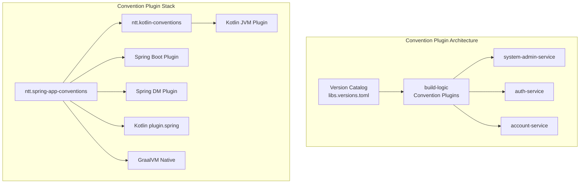
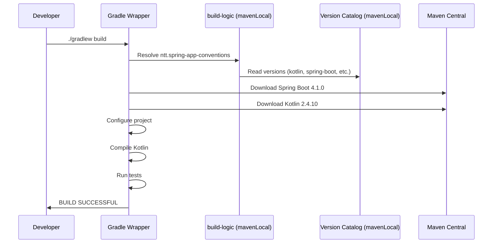

# Technical Specification: Gradle 9 Compatibility Fix

## 1. Architecture Diagram



## 2. Changes Made

### 2.1 settings.gradle.kts

```diff
plugins {
-    id("org.gradle.toolchains.foojay-resolver-convention") version "0.9.0"
+    id("org.gradle.toolchains.foojay-resolver-convention") version "1.0.0"
}
```

**Reason:** foojay 0.9.0 uses `FoojayToolchainsPlugin` and `JvmVendorSpec.IBM_SEMERU` which were removed in Gradle 9.

### 2.2 build.gradle.kts

```diff
plugins {
-    id("org.springframework.boot") version "3.2.0"
-    id("io.spring.dependency-management") version "1.1.4"
-    kotlin("jvm") version "1.9.20"
-    kotlin("plugin.spring") version "1.9.20"
+    id("ntt.spring-app-conventions")
}

-java {
-    sourceCompatibility = JavaVersion.VERSION_21
-}
-
-repositories {
-    mavenCentral()
-}
-
dependencies {
+    implementation(platform("com.ntt:platform:0.0.1-SNAPSHOT"))
    // ... dependencies ...
}

-dependencyManagement {
-    imports {
-        mavenBom("org.springframework.modulith:spring-modulith-bom:1.1.0")
-    }
-}
-
-tasks.withType<KotlinCompile> {
-    kotlinOptions {
-        freeCompilerArgs += "-Xjsr305=strict"
-        jvmTarget = "21"
-    }
-}
```

## 3. Effective Version Changes

| Component | Before | After | Source |
|-----------|--------|-------|--------|
| Kotlin | 1.9.20 | 2.4.10 | version catalog |
| Spring Boot | 3.2.0 | 4.1.0 | version catalog |
| Spring DM | 1.1.4 | 1.1.7 | version catalog |
| Gradle | 9.4.1 | 9.4.1 | unchanged |
| foojay | 0.9.0 | 1.0.0 | settings.gradle.kts |
| JVM target | 21 | 25 | kotlin-conventions |
| Spring Modulith | 1.1.0 | 2.1.0 | version catalog |
| GraalVM Native | N/A | 1.1.7 | convention plugin |

## 4. What Convention Plugin Provides

`ntt.spring-app-conventions` applies:
1. `ntt.kotlin-conventions` → Kotlin JVM plugin + compilerOptions (JVM 25, -Xjsr305=strict)
2. `kotlin("plugin.spring")` → Open classes for Spring annotations
3. `org.springframework.boot` → Spring Boot plugin
4. `io.spring.dependency-management` → BOM management
5. `org.graalvm.buildtools.native` → Native image support
6. `allOpen` for JPA entities (`@Entity`, `@MappedSuperclass`, `@Embeddable`)
7. Spring Modulith BOM (auto from version catalog if `spring-modulith` version defined)
8. Common dependencies: `kotlin-reflect`, `spring-boot-configuration-processor`, `spring-boot-starter-test`

## 5. Known Issues

### 5.1 DefaultSessionManagement.kt
File `DefaultSessionManagement.kt` imports `com.ntt.basecore.domain.session.SessionManagement` from base-core.
This requires `base-web-starter` dependency, which needs base-core to be published to mavenLocal first.

**Status:** Pre-existing issue — base-core starters haven't been published yet.
**Resolution:** Will compile successfully after `cd base-core && ./gradlew publishToMavenLocal`.

### 5.2 Base-core compilation error
Base-core `publishToMavenLocal` fails with:
```
CommonCompilerArguments.getPluginClasspaths() is null
```
This is a separate issue in base-core, not related to system-admin-service Gradle 9 fix.

## 6. Sequence Diagram: Build Flow


